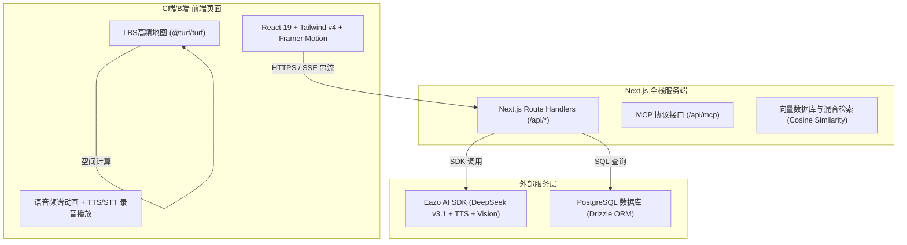
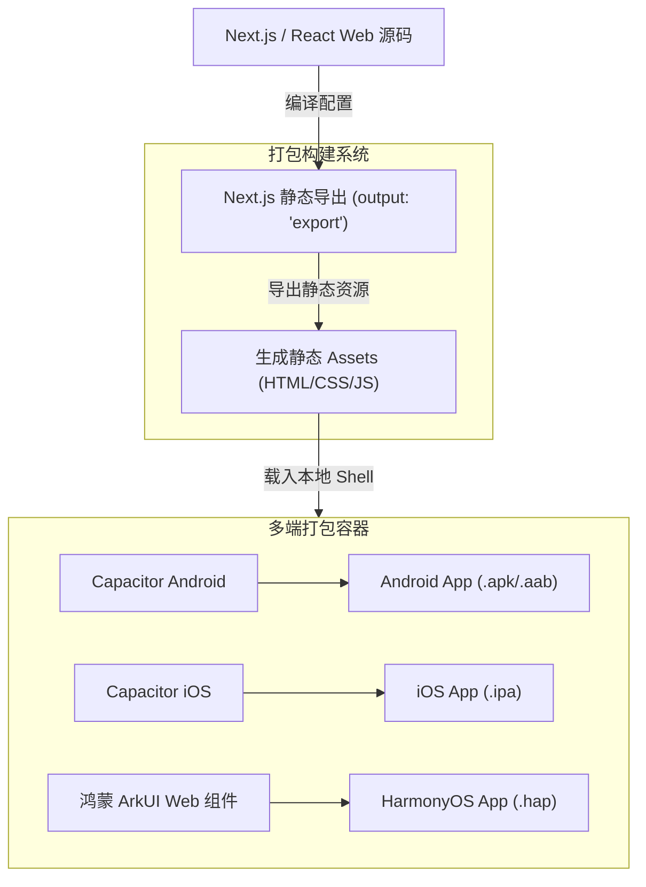
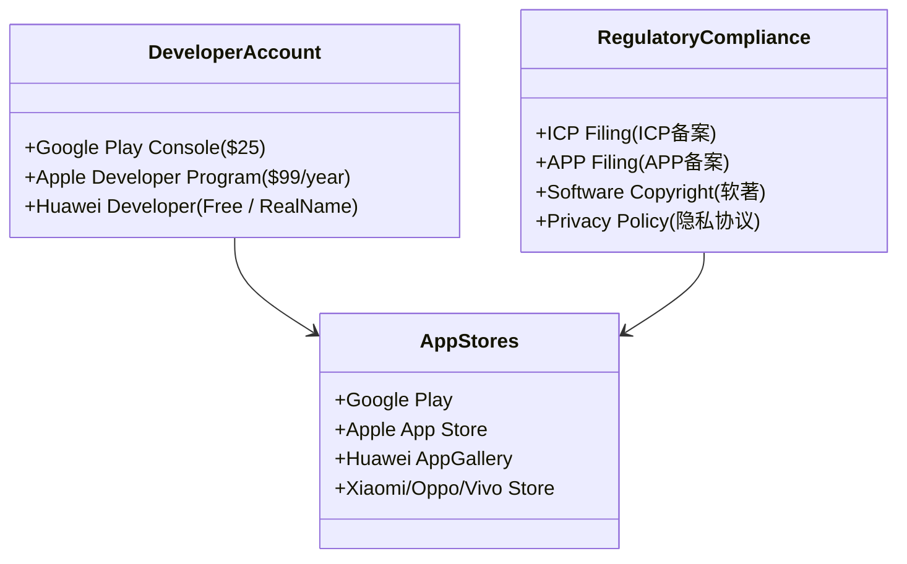

# 🤖 旅行家Pro · 跨平台移动端转换与应用商店上架完整方案

本方案旨在将现有的 **旅行家Pro**（景区AI数字人导游与运营系统平台）Web 全栈应用转换为支持 iOS、Android 以及鸿蒙 HarmonyOS 的移动端原生/混合应用，并提供详细的开发、适配及应用商店上架指南。

---

## 1. 项目技术栈与架构分析

在进行移动端转换前，首先需要理清 **旅行家Pro** 现有 Web 应用的架构与依赖关系。

### 1.1 现有 Web 应用技术架构



*   **前端交互层**：
    *   **React 19 & Next.js 16 (App Router)** 作为核心驱动。
    *   **Tailwind CSS v4** + **ShadCN / Base UI** 搭建界面，使用 **Framer Motion** 实现平滑的微交互、抽屉弹窗以及数字人表情/载入动效。
    *   **`@turf/turf`** 提供轻量级地理空间计算，用于景点间的距离与时间估算，配合前端 LBS 地图展示折线路径。
*   **后端 API & 数据库**：
    *   Next.js 服务端路由提供 RAG 混合检索、图像多模态识别（DeepSeek-VL）、语音 TTS 渲染和 STT 转换。
    *   **Drizzle ORM** 配合 **PostgreSQL** 存储 9 张核心表，包括景区、路线、用户偏好、QA 日志等。
    *   **Eazo SDK** 作为大模型接入中枢，统一调度 DeepSeek v3.1、语音合成和视觉识别。

### 1.2 移动端拆分与改造痛点

由于原项目是**全栈 Next.js 应用**，将其转换为移动应用时面临以下架构限制：
1.  **前后端无法同机运行**：移动设备（APK/IPA/HAP）无法直接运行 Node.js 运行时或数据库（PostgreSQL）。因此，必须将现有的 **Next.js 服务端代码（`/src/app/api/*`）托管在云端服务器**（如 Vercel、阿里云或 AWS），而移动客户端仅作为纯前端 Shell 运行。
2.  **API 路径变更**：原项目中的 `/api/qa/chat` 等 fetch 请求使用的是相对路径，在移动端必须变更为绝对路径（如 `https://api.travelerpro.com/api/qa/chat`）。
3.  **流式响应（SSE）与多媒体限制**：AI 聊天气泡使用 Server-Sent Events 流式输出，TTS 播放使用二进制音频流。在部分移动端 WebView 中，对流式传输及自动播放音频的安全策略限制极严，需要通过原生桥接或权限申请予以解决。

---

## 2. 跨平台转换方案

针对“旅行家Pro”，我们推荐采用 **Capacitor（混合容器）** 作为 Android 和 iOS 的主要转换路线（可最大化复用现有 Tailwind v4 + Framer Motion 的精致 UI），并针对 **鸿蒙 HarmonyOS** 采用 **ArkUI WebView 容器**或 **React Native HarmonyOS** 进行适配。



### 2.1 Android 平台转换方案 (基于 Capacitor)

#### 步骤 1：调整 Next.js 配置以支持静态导出
在 `next.config.ts` 中配置静态导出模式，因为 Android 客户端的 Web 容器需要本地读取 HTML/JS 文件。
```typescript
import type { NextConfig } from "next";

const nextConfig: NextConfig = {
  output: 'export', // 启用静态导出
  images: {
    unoptimized: true, // 禁用 Next.js 默认的图片优化服务（本地 WebView 无法运行）
  },
  // 忽略 API 路由的打包，API 路由将在云端托管运行
  eslint: {
    ignoreDuringBuilds: true,
  },
};

export default nextConfig;
```

> [!WARNING]
> 静态导出（`output: 'export'`）会使 Next.js 的动态 API 路由（`/api/xxx/route.ts`）失效。你需要确保将 `/src/app/api` 部署到云端服务器，并在前端网络请求工具（如 Axios 或 fetch 封装）中加入基准 URL（Base URL）拦截器：
> ```typescript
> const BASE_URL = process.env.NEXT_PUBLIC_API_URL || 'https://api.travelerpro.com';
> export const customFetch = (url: string, options?: RequestInit) => {
>   const absoluteUrl = url.startsWith('http') ? url : `${BASE_URL}${url}`;
>   return fetch(absoluteUrl, options);
> };
> ```

#### 步骤 2：安装并初始化 Capacitor
在项目根目录执行以下命令：
```bash
# 安装 Capacitor 核心依赖
bun add @capacitor/core
bun add -D @capacitor/cli

# 初始化项目配置，填写应用名称与 App ID (包名)
npx cap init "旅行家Pro" "com.travelerpro.guide" --web-dir=out
```

#### 步骤 3：集成 Android 平台并同步资源
```bash
# 安装 Android 平台插件
bun add @capacitor/android

# 添加 Android 原生工程目录
npx cap add android

# 打包 Next.js 项目并将静态文件同步至 Android 资产目录
bun run build
npx cap sync
```

#### 步骤 4：使用 Android Studio 调试与打包
```bash
# 启动 Android Studio 并自动打开当前项目的 android 目录
npx cap open android
```
在 Android Studio 中：
1.  检查 `AndroidManifest.xml`，配置网络权限。
2.  连接物理测试机或模拟器，点击 **Run** 运行调试。
3.  点击 **Build > Build Bundle(s) / APK(s) > Build APK** 生成 release 版安装包。

---

### 2.2 iOS 平台转换方案 (基于 Capacitor)

iOS 转换的整体链路与 Android 类似，但开发与打包过程必须在 **macOS** 环境下通过 **Xcode** 进行。

#### 步骤 1：添加 iOS 平台
在终端中执行：
```bash
# 安装 iOS 平台插件并生成 Xcode工程
bun add @capacitor/ios
npx cap add ios
```

#### 步骤 2：同步最新的 Web 资源
```bash
# 每次修改前端 Web 代码后，都需要重新 build 并 sync
bun run build
npx cap sync ios
```

#### 步骤 3：在 Xcode 中配置与编译
```bash
# 打开 Xcode 工程
npx cap open ios
```
在 Xcode 界面中：
1.  **配置 Signing & Capabilities**：选择你的开发团队（Team），系统将自动生成调试证书和 App 签名。
2.  **配置 Info.plist 隐私说明**：由于“旅行家Pro”使用了地图定位、VR拍照和数字人语音对话，必须在 `Info.plist` 中添加以下权限描述（否则上架会被拒）：
    *   `NSLocationWhenInUseUsageDescription`：用于在景区地图上为您提供实时导览和定位服务。
    *   `NSCameraUsageDescription`：用于 VR 识别功能拍照扫描文物和景点。
    *   `NSMicrophoneUsageDescription`：用于与 AI 数字人小玉进行实时语音对话。
    *   `NSSpeechRecognitionUsageDescription`：用于将您的语音转化为文字。
3.  **运行与归档**：选择目标设备，点击 **Product > Run** 进行真机测试。测试无误后选择 **Product > Archive** 生成 `.ipa` 提审包。

---

### 2.3 鸿蒙 HarmonyOS 平台转换方案

针对华为鸿蒙系统，我们提供两种适配路线：**ArkUI WebView 快速套壳方案**（适合 MVP 快速上线）与 **React Native for HarmonyOS 方案**（适合高性能的原生体验）。

#### 路线 A：ArkUI WebView 容器方案（推荐，开发速度最快）
在鸿蒙官方开发工具 **DevEco Studio** 中创建一个 **Empty Ability** 项目（Stage 模型，API 10+）。

1.  **配置网络与多媒体权限**：
    在 `entry/src/main/module.json5` 中声明权限：
    ```json
    {
      "module": {
        "requestPermissions": [
          { "name": "ohos.permission.INTERNET" },
          { "name": "ohos.permission.LOCATION", "reason": "$string:reason_location", "usedScene": { "abilities": ["EntryAbility"], "when": "inuse" } },
          { "name": "ohos.permission.MICROPHONE", "reason": "$string:reason_microphone", "usedScene": { "abilities": ["EntryAbility"], "when": "inuse" } },
          { "name": "ohos.permission.CAMERA", "reason": "$string:reason_camera", "usedScene": { "abilities": ["EntryAbility"], "when": "inuse" } }
        ]
      }
    }
    ```

2.  **编写主页面代码 (`Index.ets`)**：
    使用 ArkUI 的 `Web` 组件加载托管的 Next.js 服务端地址，并开启 DOM 存储和混合模式（Mixed Content）。
    ```arkts
    import web_webview from '@ohos.web.webview';
    import business_error from '@ohos.base';

    @Entry
    @Component
    struct Index {
      controller: web_webview.WebviewController = new web_webview.WebviewController();

      build() {
        Column() {
          Web({ 
            src: 'https://travelerpro.example.com/welcome', // 载入首屏欢迎页
            controller: this.controller 
          })
            .domStorageAccess(true)      // 开启本地存储能力 (LocalStorage/IndexedDB)
            .zoomAccess(false)           // 禁用手势缩放以保持 App 体验
            .fileAccess(true)            // 允许文件访问（用于 VR 拍照上传）
            .imageAccess(true)           // 允许图片加载
            .geolocationAccess(true)     // 允许 WebView 调用 LBS 定位
            .mixedMode(MixedModeContent.All) // 允许混合加载 HTTP/HTTPS
            .databaseAccess(true)        // 开启 Web SQL 数据库访问
            .multiWindowAccess(false)
            .width('100%')
            .height('100%')
        }
        .width('100%')
        .height('100%')
      }
    }
    ```

#### 路线 B：React Native for HarmonyOS 方案
华为官方与 React Native 开源社区合作提供了鸿蒙原生渲染引擎，这允许我们将 Next.js 的组件逻辑转化为真正的鸿蒙原生组件（ArkUI）。
1.  **引入鸿蒙适配版 RN**：在项目根目录引入 `@react-native-ohui/react-native-harmony` 依赖。
2.  **编写 React 原生代码**：将基于 DOM 的 HTML 标签（如 `div`, `span`）替换为 RN 的基础组件（`View`, `Text`）。
3.  **构建输出**：使用 DevEco Studio 编译为 `.hap` 包，能够获得极佳的数字人骨骼动画帧率和流式语音响应速度。

---

## 3. 应用商店上架指南

移动端打包完成后，需要分别将应用上架到全球及国内的主流应用市场。



### 3.1 Google Play Store 上架流程

#### 准备材料
*   开发者账号：一次性缴纳 25 美元。
*   应用签名密钥（由 Android Studio 托管生成）。
*   隐私政策 URL：必须包含收集用户音频（用于数字人对话）和位置信息（用于导览）的安全声明。

#### 操作步骤
1.  **创建应用**：登录 Google Play Console，点击 **Create app**，填写默认语言及应用分类。
2.  **设置应用内容（Content Rating）**：完成问答表，重点声明应用是否包含 AI 生成内容。**“旅行家Pro”包含大模型（DeepSeek）的交互，必须声明存在敏感词过滤和用户举报拉黑机制。**
3.  **声明数据安全（Data Safety）**：
    *   明确勾选收集“精确位置”（Precise Location）和“音频文件”（Voice/Audio Recordings）。
    *   解释收集目的：用于提供地图路径规划和数字人语音流式问答。
4.  **上传发布包**：在 Android Studio 中选择 **Generate Signed Bundle**，导出 `.aab` 格式，上传至 Play Console 的“Production”轨道。
5.  **提交审核**：提交后，首次审核通常需要 3 至 7 天。

---

### 3.2 国内 Android 主流市场上架流程 (含合规要求)

国内市场（华为、小米、OPPO、VIVO、腾讯应用宝）对应用合规性的审查在近两年变得极其严格，缺少相关资质将无法通过审核。

#### 关键前置合规资质 (必须办理)
1.  **ICP 备案与 APP 备案**：
    *   根据工业和信息化部要求，App 的 API 服务端域名必须完成 **ICP 备案**。
    *   App 自身必须完成 **APP 备案**（需通过云服务商如阿里云、腾讯云，提交 App 包名、公钥及 SHA256 指纹进行申报）。
2.  **软件著作权登记证书（简称“软著”）**：
    *   由中国国家版权局颁发，申请周期一般为 20-30 个工作日。
    *   证书名称必须与 App 上架名称一致或存在包含关系。
3.  **隐私协议（GDPR / 个人信息保护法合规）**：
    *   App 首次启动时，**必须且只能**先弹窗展示《用户协议》和《隐私政策》，用户点击“同意”前，App **绝对不能**静默调用任何获取精确定位、麦克风权限或设备 ID（如 IMEI、OAID）的 SDK。

#### 各平台提审入口
*   **华为应用市场**：[华为开发者联盟](https://developer.huawei.com/)
*   **小米应用商店**：[小米开放平台](https://dev.mi.com/)
*   **OPPO 软件商店**：[OPPO 开放平台](https://open.oppomobile.com/)
*   **VIVO 应用商店**：[VIVO 开放平台](https://developer.vivo.com.cn/)

---

### 3.3 Apple App Store 上架流程与避坑指南

iOS 审核由苹果 App Review 团队人工进行，其规范（App Store Review Guidelines）极其严格。

#### 核心审核条款应对方案
*   **Guideline 2.1 - Performance (性能与稳定性)**：
    *   **避坑指南**：打包时切勿包含任何 Placeholder（占位符）或测试数据。确保“模拟票务购买”流程有明确的“沙盒/测试环境提示”，不要让审核员误以为是支付漏洞。
*   **Guideline 4.8 - Sign in with Apple (苹果登录桥接)**：
    *   **避坑指南**：如果你的 App 提供了微信登录或手机号一键登录，在 iOS 端**必须同时提供“通过 Apple 登录”**的选项，且其视觉权重不能低于第三方登录。
*   **Guideline 5.1.1 - Privacy (数据收集与存储)**：
    *   **避坑指南**：必须提供**注销账户**的功能（入口一般在个人中心 `ProfileScreen` 中）。注销必须是物理删除，且在 72 小时内生效。
*   **AI 合规性问题**：
    *   由于数字人导游输出的内容具有生成式特征，提审时需要在 App 信息中选择“年龄分级 17+”或在显著位置提供“AI 内容免责声明”与“一键举报不良回答”的按钮。

---

### 3.4 鸿蒙应用市场 (Huawei AppGallery) 上架流程

鸿蒙纯原生应用（`.hap` / `.app`）需通过华为 AppGallery Connect 渠道进行提审。

#### 准备材料
1.  **鸿蒙应用证书（.cer）与 Profile（.p7b）**：
    需要在华为开发者联盟的“证书管理”和“设备管理”中绑定你的开发机指纹（UDID），并下载对应的签名文件。
2.  **DevEco Studio 签名配置**：
    在 File -> Project Structure -> Signing Configs 中配置获取到的证书密钥。
3.  **发布上架**：
    在 AppGallery Connect 中新建“HarmonyOS 应用”，填写基本描述，上传通过 DevEco Studio 生成的打包产物（Release 类型的 `.app` 包），提交人工审核。

---

## 4. 平台适配要点

### 4.1 UI/UX 适配要求与最佳实践

由于移动端设备的屏幕比例（16:9 到 21:9）、异形屏（刘海屏、水滴屏、灵动岛）十分多样，UI 必须要做出精细调整。

```html
<!-- 移动端全面屏安全区域填充示例 -->
<div class="min-h-screen flex flex-col pt-[var(--safe-area-top)] pb-[var(--safe-area-bottom)] bg-stone-50 dark:bg-emerald-950">
  <!-- 头部 Header 保护 -->
  <header class="h-16 flex items-center px-4 sticky top-0 z-50">
    <h1 class="text-xl font-bold">小玉导游</h1>
  </header>
  
  <!-- 滚动问答区域 -->
  <main class="flex-1 overflow-y-auto">
    <!-- Chat Screen Content -->
  </main>
</div>
```

*   **安全区域（Safe Area）适配**：
    *   在 CSS 中，全局使用系统安全区域变量避免底部导航栏（Home Indicator）或顶部刘海遮挡交互按钮：
        ```css
        :root {
          --safe-area-top: env(safe-area-inset-top, 20px);
          --safe-area-bottom: env(safe-area-inset-bottom, 10px);
        }
        ```
*   **移动端触摸靶区（Touch Targets）**：
    *   所有的点击元素（如录音按钮、VR拍照按钮、路线折叠面板）高度和宽度不得低于 **`44px * 44px`**，以防误触。
*   **Webview 视口弹性拉伸（Bouncing Effect）**：
    *   iOS 默认的 WebView 在滚动到顶部或底部时会有明显的“橡皮筋”回弹，这会降低 Hybrid App 的原生感。可以通过 CSS 属性进行限制：
        ```css
        body, html {
          overscroll-behavior-y: none; /* 禁用系统级下拉刷新/回弹动效 */
          -webkit-overflow-scrolling: touch; /* 保证 iOS 滚动平滑度 */
        }
        ```

---

### 4.2 性能优化建议

*   **流式响应（SSE）内存回收**：
    *   数字人问答界面 `QAScreen` 使用的打字机流式输出，每次接收到字符片断时都会触发 React 重新渲染。在低配 Android 手机上，频繁重新渲染会导致卡顿。
    *   **优化方案**：使用 React 的 `useRef` 暂存流式数据，并通过节流函数（Throttle，每 80ms）更新一次 state 渲染，以显著降低 CPU 占用。
*   **大图资源与音频预加载**：
    *   VR 即拍即识中包含的三星堆青铜树等高清 3D 效果图片，应全部进行 WebP 压缩，或存放在 CDN 上。
    *   使用 Eazo TTS 生成的流式音频，可使用浏览器的 `AudioContext` 进行预解码缓冲，避免语音播放出现“首字延迟”。

---

### 4.3 权限配置与隐私安全合规

移动端对于传感器和隐私数据的调取管控极其严格，必须遵循 **“最小够用”** 原则。

```javascript
import { Geolocation } from '@capacitor/geolocation';

// 动态地理定位权限请求示例
async function requestLocationPermission() {
  const status = await Geolocation.checkPermissions();
  if (status.location !== 'granted') {
    const requestResult = await Geolocation.requestPermissions();
    if (requestResult.location !== 'granted') {
      alert('为了在地图上展示您的游览轨迹，请在系统设置中允许定位权限');
      return false;
    }
  }
  return true;
}
```

*   **位置权限申请时机**：
    不要在 App 首次打开时立即申请定位。正确的交互是在用户点击“开始行程规划”或“生成游览路线”时，再调用定位权限接口。
*   **HTTPS 强制要求**：
    所有云端接口必须强制使用 TLS 1.2 或以上的 HTTPS 协议，iOS WebView 会默认拦截所有非加密的 HTTP 网络请求。

---

### 4.4 离线功能与本地存储适配

景区内网络信号通常较弱（如溶洞、山区、古建群内），必须设计完善的离线缓存策略。

| 存储媒介 | 适用场景 | 读写速度 | 容量限制 | 离线保留时长 |
| :--- | :--- | :--- | :--- | :--- |
| **LocalStorage** | 存储用户的主题设置、AI 偏好（normal/elder/child） | 极快 | 约 5MB | 永久（除非手动清理） |
| **Capacitor Preferences** | 存储用户访问 Token、历史对话会话 ID | 快 | 无限制（映射到 iOS Keychain/Android SharedPreferences） | 永久且安全 |
| **IndexedDB (LocalForage)** | 缓存已下载的离线景点详情数据、推荐行程路线 | 中 | 视设备剩余空间而定 (通常数百MB) | 长期 |

*   **离线骨架屏（Skeleton Screen）**：
    在景点列表 `SpotsScreen` 加载数据时，提供基于 Tailwind 的脉冲闪烁骨架屏（`animate-pulse`），在无网时自动载入上一次缓存在 IndexedDB 中的静态景点列表（如 `national-spots.ts`）。

---

## 5. 开发工具链与构建流程

### 5.1 推荐的工具链与开发环境配置

| 平台 | 开发 IDE | 必备依赖包/运行时 | 硬件环境要求 |
| :--- | :--- | :--- | :--- |
| **Web / Node 端** | VS Code | Node.js v20+ / Bun v1.3.9+ | 无限制 (Windows/macOS/Linux) |
| **Android 平台** | Android Studio | Android SDK 34+ / Gradle v8.0+ | 8G+ 内存 (推荐 16G+) |
| **iOS 平台** | Xcode | Cocoapods (依赖包管理) | 必须为 **macOS** 物理机/虚拟机 |
| **鸿蒙 HarmonyOS** | DevEco Studio | Ohpm (鸿蒙包管理) / HarmonyOS SDK 4+ | Windows 10+ 或 macOS 12+ |

---

### 5.2 CI/CD 自动化构建流配置建议

为了提升团队迭代效率，建议在 GitHub 上配置 **GitHub Actions** 自动化流水线，在每次发布 Release 时自动编译 Android AAB 和 iOS 提审包。

以下是适用于“旅行家Pro”项目的 GitHub Actions 配置文件示例（`.github/workflows/build-mobile.yml`）：

```yaml
name: Build Mobile Apps (Android & iOS)

on:
  push:
    tags:
      - 'v*' # 仅在推送版本标签时触发构建

jobs:
  build-android:
    runs-on: ubuntu-latest
    steps:
      - name: Checkout Source Code
        uses: actions/checkout@v4

      - name: Setup Bun Environment
        uses: oven-sh/setup-bun@v1
        with:
          bun-version: 1.3.9

      - name: Install Dependencies
        run: bun install

      - name: Build Next.js Static Export
        run: bun run build
        env:
          NEXT_PUBLIC_API_URL: ${{ secrets.PRODUCTION_API_URL }}

      - name: Setup Java JDK
        uses: actions/setup-java@v3
        with:
          distribution: 'zulu'
          java-version: '17'

      - name: Sync Web Assets to Android Project
        run: |
          npx cap sync android

      - name: Build Android App Bundle (Release AAB)
        run: |
          cd android && ./gradlew bundleRelease

      - name: Upload Android Build Artifact
        uses: actions/upload-artifact@v3
        with:
          name: traveler-pro-release.aab
          path: android/app/build/outputs/bundle/release/app-release.aab

  build-ios:
    runs-on: macos-latest
    steps:
      - name: Checkout Source Code
        uses: actions/checkout@v4

      - name: Setup Bun Environment
        uses: oven-sh/setup-bun@v1
        with:
          bun-version: 1.3.9

      - name: Install Dependencies
        run: bun install

      - name: Build Next.js Static Export
        run: bun run build
        env:
          NEXT_PUBLIC_API_URL: ${{ secrets.PRODUCTION_API_URL }}

      - name: Install Cocoapods Dependencies
        run: |
          npx cap sync ios
          cd ios/App && pod install

      - name: Build and Archive iOS IPA (using Fastlane)
        run: |
          cd ios/App
          # 注意：此步需要配置 Fastlane 及其 App Store Connect 密钥
          # fastlane gym --scheme "App" --output_directory "./build" --output_name "TravelerPro.ipa"
```
