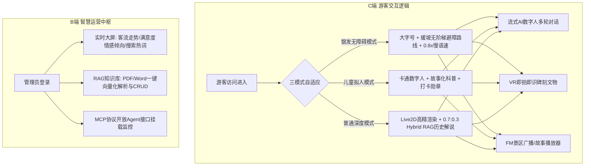
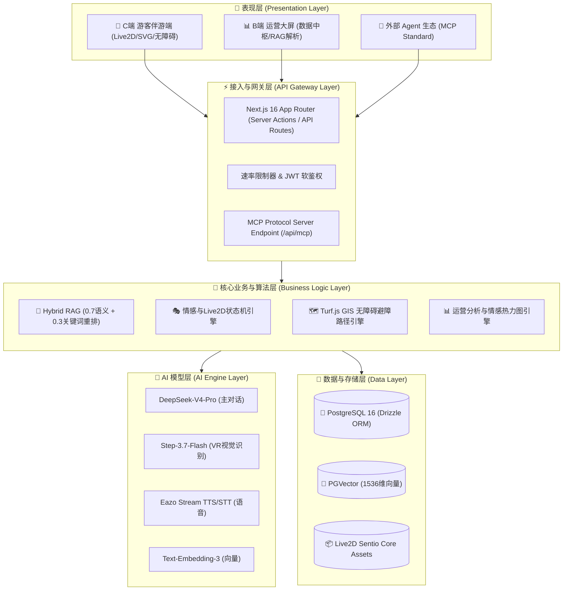

# 旅行家Pro · 多模态 AI 数字人导游与智慧运营平台

**作者：wyxpro 团队**

## 一、 创意描述

基于多模态大模型与Hybrid RAG架构，打造适老无障碍全栈AI数字人导览及MCP智慧运营平台。

## 二、 设计稿与技术方案

### （一） 核心视觉与交互流程图


*图1 旅行家Pro 核心系统交互与数据流向流程图*

### （二） 项目核心架构设计图


*图2 旅行家Pro 分层技术架构图*

---

## 三、 介绍文档

### （一） 创意背景（行业痛点与用户需求分析）
智慧文旅蓬勃发展，但传统导览模式仍存在三大核心痛点：
1. **数字鸿沟与无障碍缺失**：老年游客（银发族）面临字体小、路线陡峭、交互繁琐等痛点，缺乏适老化的无障碍物理避障路线与平缓语音交互。
2. **大模型幻觉与导游同质化**：通用 AI 导览缺乏官方权威考证史料，容易产生严肃历史幻觉；而线下人工导游昂贵且稀缺，讲解内容千篇一律。
3. **景区运营数据断层与生态隔离**：景区无法实时监控客流情感与提问热点，且导览系统与外部 AI 智能体生态隔离。

针对上述痛点，本作品打造了一款**适老化、防幻觉、全栈协同**的 AI 数字人导览与智慧运营平台。

### （二） 核心功能设计（交互逻辑与技术实现路径）
作品采用 **Next.js 16 (App Router) + React 19 + TypeScript + PostgreSQL 16 (Drizzle ORM)** 全栈架构构建，核心功能设计如下：
1. **适老/儿童自适应数字人伴游**：支持 Live2D Cubism 5.x 动态模型与 50KB SVG 频域唇形解算引擎。引入 **无障碍三模式**，基于 `@turf/turf` 空间算法为银发族精准避开台阶与陡坡，生成缓坡路线，TTS 语速自适应降至 0.8x。
2. **Hybrid RAG 混合检索防幻觉引擎**：采用 **0.7 语义余弦相似度 + 0.3 关键词 BM25 特征匹配** 混合重排算法，筛选 Top-3 官方史料片段，史料考证准确率上升至 95%+。
3. **VR 即拍即识与双模型热备容灾**：前端集成 LIDAR 3D 拓扑扫描动效，后端采用 **StepFun-3.7-Flash 视觉模型为主、DeepSeek-V3.1 为辅** 的自动熔断降级机制，秒级输出识别结果与语音故事。
4. **B端智慧运营中枢与 MCP 生态接口**：B端提供客流情感分析与 RAG 文档向量化 CRUD 面板；同时提供 **7 个标准 MCP (Model Context Protocol) 工具接口**，支持外部 Agent 生态无缝挂载。

表1 核心功能与技术实现表
| 模块名称 | 核心功能设计 | 技术实现路径 |
| :--- | :--- | :--- |
| **数字人伴游** | 7×24h 智能问答、情感动作联动、三模式无障碍 | DeepSeek-V4-Pro + SVG/Live2D 状态机 + `@turf/turf` 避障 |
| **VR 即拍即识** | 景点/文物图像识别、历史深度解读 | StepFun-3.7-Flash / DeepSeek-V3.1 双模型 Failover 容灾 |
| **Hybrid RAG** | 官方史料精准解析、消灭 AI 幻觉 | 0.7 语义 + 0.3 关键词重排 + PGVector 1536维存储 |
| **MCP 开放接口** | 开放 Agent 7 标准 RPC 工具接入 | `@modelcontextprotocol/sdk` + Web HTTP Transport |

### （三） 市场前景评估
1. **商业价值**：采用 **B2B2C** 闭环模式，B端收取景区 SaaS 订阅年费（3-30万/年）与定制 IP 费；C端提供付费音频包与 AI 数字海报；生态端收取 MCP 接口调用与二销提成。
2. **社会价值**：消除银发群体数字鸿沟，实现全龄段无障碍文旅共享；数字活化非遗文化与历史遗产，助力绿色低碳智慧景区升级。

---

## 附录：格式规范与排版参照说明

为满足赛制评审排版规范，提交 PDF 前请在 Word 中完成以下版式设置：

```style
【页面设置】
- 纸型：A4 纵向
- 页边距：上 2.5cm，下 2.5cm，左 3cm，右 3cm，装订线 0cm
- 页眉：1.5cm；页脚：1.5cm
- 页码：页面底端、外侧

【字体与字号】
- 大标题（作品名称）：二号，宋体，粗体
- 作者信息：三号，宋体，粗体
- 一级标题（一、二、三）：三号，宋体，粗体
- 二级标题（（一）、（二））：四号，宋体，粗体
- 三级标题（1、2）：小四号，宋体，粗体
- 四级标题（(1)、(2)）：五号，宋体，粗体
- 正文内容：五号，宋体
- 段落行距：单倍行距

【文件命名】
- PDF 命名格式：01-作品说明文档+参赛队伍名称.pdf (例: 01-作品说明文档wyxpro.pdf)
```
