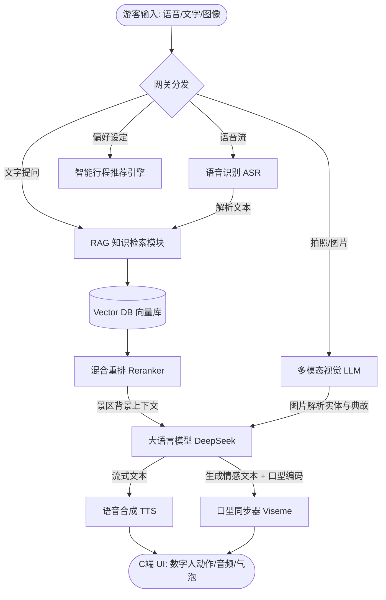

# 旅行家ProPro · AI 能力对接指南 (ai.md)

本指南针对《旅行家ProPro · 个性化多智能体景区伴游系统》的 C 端核心模块（**智能导游**、**热门景点**、**AI数字人导游**、**行程规划**、**我的**）进行全面 AI 能力剖析。文档列出了各模块的具体对接能力、推荐模型、实现步骤、提示词策略以及接口开发规范，旨在指导系统的进一步迭代升级。

---

## 目录
1. [系统 AI 架构图](#1-系统-ai-架构图)
2. [核心模块 AI 能力对接矩阵](#2-核心模块-ai-能力对接矩阵)
3. [各界面对接能力详解与步骤](#3-各界面对接能力详解与步骤)
   - [3.1 智能导游 (Home)](#31-智能导游-home)
   - [3.2 热门景点 (Spots & SpotDetail)](#32-热门景点-spots--spotdetail)
   - [3.3 AI 数字人导游 (QA)](#33-ai-数字人导游-qa)
   - [3.4 行程规划 (Routes)](#34-行程规划-routes)
   - [3.5 我的 (Profile & Settings)](#35-我的-profile--settings)
4. [推荐 AI 模型清单](#4-推荐-ai-模型清单)
5. [提示词 (Prompt) 黄金策略与示例](#5-提示词-prompt-黄金策略与示例)
6. [接口与数据对接规范 (JSON Schema)](#6-接口与数据对接规范-json-schema)

---

## 1. 系统 AI 架构图

以下为本项目核心 AI 功能的运行链路及多智能体协作机制：



---

## 2. 核心模块 AI 能力对接矩阵

| 模块名称 | 对应页面/组件 | 对接 AI 核心能力 | 推荐对接模型 | 数据交互特性 |
| :--- | :--- | :--- | :--- | :--- |
| **智能导游** | `HomeScreen` / `SearchScreen` | 语音唤醒与搜索、混合检索、多模态拍照识景 | Whisper, FunASR, Qwen-VL | 流式音频上传，图片 Base64 解析 |
| **热门景点** | `SpotDetailScreen` / `FMScreen` | 景点亮点精炼、故事广播剧本流式生成、特色声线合成 | DeepSeek-V3, CosyVoice, Edge-TTS | 长文本生成，分章节流式音频输出 |
| **AI数字人导游** | `QAScreen` | 知识库 RAG 问答、多轮上下文维护、表情/动作联动、TTS 口型同步 | DeepSeek-R1 (推理), text-embedding-3, Edge-TTS | SSE (流式回复), Web Audio 振幅提取 |
| **行程规划** | `RoutesScreen` / `RouteDetailScreen` | 智能路径推荐算法、约束满足动态排程、天气与避坑指南生成 | DeepSeek-V3 (JSON 模式), GPT-4o-mini | 强类型 JSON 格式交互 |
| **我的** | `ProfileScreen` / `AISettingsScreen` | 用户特征画像标签提取、无障碍策略自适应、个性化音色微调 | DeepSeek-V3 (轻量级分类) | 离线计算，配置表关联 |

---

## 3. 各界面对接能力详解与步骤

### 3.1 智能导游 (Home)
智能导游界面主要为用户提供便捷的“入口级”服务。

#### A. 核心对接能力
1. **智能全局搜索 (Semantic Search)**：传统搜索只支持关键字匹配。通过接入向量嵌入（Embeddings），用户输入“水鸟在哪里看”或“我想喝茶聊天的地方”能智能匹配到“翠玉湖”和“听松轩”。
2. **多模态拍照识别 (Vision Landmark/Artifact Recognition)**：用户拍摄景点牌楼、石碑、文物，系统能自动识别出实体并进行深度讲解。
3. **快速语音检索 (ASR/STT)**：提供一键麦克风检索功能。

#### B. 对接开发步骤
1. **语义搜索**：
   - 使用 `text-embedding-3-small` 模型将“景点介绍”和“知识库”预先存入向量数据库（如 pgvector / Drizzle 扩展）。
   - 用户提问时，通过后端计算余弦相似度（`cosineSimilarity`），调取相似度分值前 3 的景点作为检索结果展示。
2. **拍照识别**：
   - 移动端调用摄像头拍摄照片并压缩至 `1024x1024` 像素以内。
   - 后端转化为 Base64 后调用 Vision 接口，识别图片中的文字或典型标志物，返回景点的匹配 ID 或背景介绍。
3. **语音检索**：
   - 使用 `MediaRecorder` API 将用户录制的 PCM/MP3 格式音频分段上传，通过 Whisper ASR 转为文字。

---

### 3.2 热门景点 (Spots & SpotDetail)
热门景点部分聚焦于景点深度游览与故事挖掘，特别是加入了**沉浸式故事讲解模式 (FMScreen)**。

#### A. 核心对接能力
1. **历史故事脚本流式生成**：将学术性景点文字转化为第一人称口语化“剧本”，配合背景音乐提示。
2. **多人物角色配音 (Role-based TTS)**：支持男声（饱学学子）、女声（导游小玉）的声线切换，语气自然带情感。

#### B. 对接开发步骤
1. **剧本处理**：
   - 当用户点击“故事讲解模式”时，后端调用大模型，传入该景点的历史信息和用户选择的“故事类型”（如“明清传说”或“建造纪实”）。
   - 要求模型输出 JSON 数组，每个元素包含“讲解词”、“背景音效提示”及“情感基调”。
2. **音频流式合成**：
   - 使用流式 TTS，大模型吐出一句，TTS 就异步合成一句，避免用户等待整篇合成的高延迟。

---

### 3.3 AI 数字人导游 (QA)
本模块是项目技术密度最高的交互界面，包含多轮对话、实时检索、数字人形象表达及口型音画同步。

#### A. 核心对接能力
1. **景区知识库 RAG (Retrieval-Augmented Generation)**：杜绝大模型胡说八道（幻觉），只根据管理员上传的本地知识库文件作答。
2. **多轮对话上下文合并**：妥善提取并缩减历史记忆，节省 token 消耗。
3. **情感表情映射**：大模型根据语义在首行生成 `[情感: 愉快]` 或 `[情感: 思考]` 表情标记。
4. **数字人口型振幅同步 (Viseme Lip-Sync)**：提取合成语音（TTS）的实时音频频域振幅，驱动 SVG 头像的嘴部物理开合。

#### B. 对接开发步骤
1. **RAG 处理流程**：
   - 用户提问 $\rightarrow$ 计算问题 Embedding $\rightarrow$ 检索知识库 $\rightarrow$ 提取前 3 条相关度数据 $\rightarrow$ 拼接为 System Prompt $\rightarrow$ 提交给 DeepSeek 大模型。
2. **表情标签解析**：
   - 前端接收 SSE 流数据时，使用正则表达式 `^\[情感:\s*(.*?)\].*` 解析首行文字。
   - 解析成功后修改 React 状态 `avatarState` 为 `happy / thinking / speaking`，数字人动画立即切换对应动画帧。
   - 过滤掉表情文本后，再将文字渲染进对话气泡。
3. **口型同步实现**：
   - 客户端建立 `AudioContext` 并创建 `AnalyserNode`。
   - 监听音频播放进度，实时提取字节频率数据（`getByteFrequencyData`）。
   - 将高频及低频振幅折算为 $0 \sim 1$ 的开合度（`mouthAmplitude`），映射为 SVG 嘴部二次贝塞尔曲线的高度：`M 44 71 Q 50 ${71 + 8 + amplitude * 12} 56 71`。

---

### 3.4 行程规划 (Routes)
行程规划协助用户解决“路线排期”的繁琐任务。

#### A. 核心对接能力
1. **多目标约束行程推荐**：基于大模型的推理能力，在海量景点中，依据总时间约束（如“半天”或“整天”）、交通约束、人群特质（如有老人需要平坦少台阶路线），输出推荐路线。
2. **结构化 JSON 强校验**：大模型必须严格返回预期的 JSON 结构，以便前端直接渲染地图卡片和景点路标。

#### B. 对接开发步骤
1. **提示词约束**：
   - 使用 System Prompt 设定结构规范，强制在 Response 阶段启用大模型的 JSON Mode（`response_format: { type: "json_object" }`）。
2. **输出校验**：
   - 接口接收大模型生成的 JSON，使用 Zod 库（`schema.safeParse`）校验数据。若校验失败，则降级启动本地备用推荐路线（基于硬编码规则匹配）。

---

### 3.5 我的 (Profile & Settings)
个人中心用于记录用户偏好，并对 AI 智能助手进行个性化微调。

#### A. 核心对接能力
1. **用户出行倾向分析 (User Profiling)**：根据用户以往提问的历史记录（如经常问“历史”、“门票价格”还是“洗手间位置”），提炼用户画像标签（如“深度历史游”、“效率实用派”）。
2. **偏好配置映射**：将用户在“AI设置”中调整的关怀模式（如“老年关怀：字体变大、语速慢”）保存，并在下一次请求 QA 接口时，将对应配置注入 System Prompt。

#### B. 对接开发步骤
1. **画像提取**：
   - 定时任务（或用户退出登录时）调取用户近期的多轮对话日志，由大模型归纳出 $3 \sim 5$ 个中文标签存入 `userPreferences` 表。
2. **策略自适应**：
   - 在 `POST /api/qa/chat` 中调取用户当前的偏好设置：
     ```typescript
     const prompt = user.accessibilityMode === "elder" 
       ? ACCESS_PROMPTS.elder 
       : ACCESS_PROMPTS.normal;
     ```

---

## 4. 推荐 AI 模型清单

结合高性价比与开发易用性，推荐以下模型对接方案：

| 维度类别 | 推荐对接服务/开源项目 | 特点优势 | 接入性价比与延迟 |
| :--- | :--- | :--- | :--- |
| **大语言模型 (LLM)** | **DeepSeek-V3** | 通用对话与推理能力极强，完全媲美 GPT-4o，价格极低。 | 推荐首选（API 费用约 1元/百万 Tokens，延迟较低） |
| **深度推理 (Reasoning)** | **DeepSeek-R1** | 适合复杂行程规划、深奥历史学术典故推导。 | API 响应时间偏长（思考时间约 5-15s），可用于后台静态规划 |
| **多模态视觉 (Vision)** | **GPT-4o-mini / Qwen-VL-Max** | 具备极强的图像识别及中文字符、碑文解析能力。 | 拍照识景首选，响应时间 1.5s 左右 |
| **语音转文字 (ASR)** | **OpenAI Whisper-Large-v3** | 支持全球多语种，对中英文混杂、口音识别效果优秀。 | 适合日常语音问答输入 |
| **文字转语音 (TTS)** | **Edge TTS / 阿里 CosyVoice** | CosyVoice 支持极高质量的声音克隆；Edge TTS 提供完全免费、免 API Key 且极度流畅的中英文合成。 | QA 界面语音播放首选 Edge TTS（轻量高响应） |
| **向量查找 (Embedding)** | **text-embedding-3-small** | OpenAI 官方提供，1536 维，多语言检索相关性好。 | 价格极其低廉 |

---

## 5. 提示词 (Prompt) 黄金策略与示例

提示词的好坏直接决定了数字人回复的质量，以下是为本系统定制的提示词策略。

### 5.1 AI 导览问答多轮 System Prompt
该提示词作为 `ACCESS_PROMPTS.normal` 的核心骨架，注入了景区历史文化、语气设定及限制：

```markdown
# 角色与语气限制
你叫小玉，是翠玉景区的专属AI智能导览官。你的声音亲切、语速适中，对于带小孩的游客活泼逗趣，对于老年游客关怀细致，对于学术型游客知识渊博。
请保持回复简明扼要（限制在 200 字内），分段清晰，善用 emoji 表情。

# 核心功能限制：情感标记合成
在你的每句回复最前面，你必须强制带有当前句子的情感倾向标签，格式必须为 "[情感: 愉快/平静/伤感/思考]"。例如：
- "[情感: 愉快]您好！今天天气真棒，揽月亭是极好的去处呢！🌲"
- "[情感: 思考]关于揽月亭牌坊的来历，相传在清乾隆年间..."

# 知识召回约束 (RAG)
1. 你的回答必须完全参考以下提供的【景区知识库参考】。如果知识库中不包含该信息，请礼貌地回答：“小玉暂时在知识库里找不到这个内容，建议您前往服务中心咨询或者询问人工导游哦。”
2. 绝对不能捏造景区票价、开放时间、交通等关键安全和资费信息！

# 景区知识库参考
{knowledgeCtx}
```

### 5.2 智能行程规划 (Prompt for JSON Mode)
用于在行程规划页面强行约束大模型按格式输出路线数据：

```markdown
# 任务描述
你是一名资深景区行程规划专家，请根据游客的需求生成一条定制的景区游览路线。

# 约束条件
1. 只能使用以下给定的景点 ID 进行路线串联：[1 (揽月亭), 2 (翠玉湖), 3 (听松轩), 4 (百花谷), 5 (古窑遗址), 6 (溪流栈道)]。
2. 路线必须考虑时间顺序，行程时长合理。
3. 必须输出以下指定的标准 JSON 格式，不要返回任何 Markdown 标记或多余的解释文字！

# 目标 JSON 格式 Schema
{
  "routeName": "定制路线的简短标题 (如：午后亲子生态游)",
  "totalDurationMinutes": 120, // 预计游览总分钟数
  "targetCrowd": "适合的人群说明",
  "difficulty": "easy / medium / hard",
  "routeNodes": [
    {
      "spotId": 1,
      "recommendStayMinutes": 30,
      "tips": "此景点台阶较多，老人请扶好栏杆漫步。"
    },
    {
      "spotId": 2,
      "recommendStayMinutes": 45,
      "tips": "可在湖畔码头乘坐游船赏荷花。"
    }
  ],
  "summary": "针对本条路线的温馨提示及亮点总结。"
}
```

---

## 6. 接口与数据对接规范 (JSON Schema)

### 6.1 多轮对话流式返回 (SSE API)
- **请求地址**：`POST /api/qa/chat`
- **请求体**：
  ```json
  {
    "question": "揽月亭有什么好玩的故事？",
    "history": [
      { "role": "user", "content": "你好" },
      { "role": "assistant", "content": "[情感: 愉快]你好呀！" }
    ],
    "stream": true
  }
  ```
- **流式响应格式** (Server-Sent Events)：
  - 第一帧携带情感头标记：
    ```text
    data: {"delta": "[情感: 思考]关于"}
    ```
  - 后续帧持续输出对话正文：
    ```text
    data: {"delta": "揽月亭的故事，相传在明代嘉靖年间..."}
    ```
  - 结束帧：
    ```text
    data: [DONE]
    ```

### 6.2 多模态拍照识景接口 (Vision API)
- **请求地址**：`POST /api/spots/recognize`
- **请求体**：
  ```json
  {
    "image": "data:image/jpeg;base64,/9j/4AAQSkZJRgABAQEASABIAAD/2wBDAAMCAgMCAgMDAwMEAwMEBQpg..."
  }
  ```
- **响应体**：
  ```json
  {
    "success": true,
    "matchedSpotId": 1, 
    "confidence": 0.94,
    "spotName": "揽月亭",
    "aiIntroduction": "经AI检测，您拍摄的是景区地标‘揽月亭’。它始建于明代，目前正值中秋赏月季，是最佳的观景点..."
  }
  ```

---

### 💡 结语
《旅行家ProPro》系统在 UI 层面已经实现了精美的前端视觉。通过对接本指南提供的 **多智能体 RAG 架构** 与 **流式 ASR/TTS 表情联动**，可将系统升级为行业领先的多模态导览系统，切实为游客提供高水平、具备丰富情感和个性化关怀的旅行伴侣体验。
