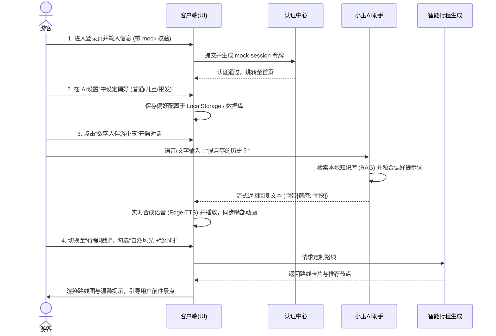

# 🧭 旅行家 · 智能景区多智能体伴游系统 (cool.md)

---

## 📖 目录
1. [一、产品概述 🚀](#一产品概述-)
2. [二、技术架构 🏗️](#二技术架构-)
3. [三、核心功能 🌟](#三核心功能-)
4. [四、特色功能 💎](#四特色功能-)
5. [五、AI具体应用 🤖](#五ai具体应用-)
6. [六、界面流程 📱](#六界面流程-)
7. [七、商业模式 💰](#七商业模式-)
8. [八、项目总结 📝](#八项目总结-)

---

## 一、产品概述 🚀

### 1. 项目背景
随着文旅行业的数字化转型与消费体验升级，游客对景区游览的个性化、互动性及沉浸感提出了更高要求。传统的物理导游成本高、时间受限；而传统的电子导览机内容死板、无法进行多轮智能交互。在国家“智慧旅游”政策引导下，本项目推出了一款基于大语言模型与多模态交互的**智慧伴游系统**。

### 2. 项目简介
**《旅行家》** 是一款面向 C 端游客的个性化多智能体景区伴游系统。系统以“AI数字人导游小玉”为交互核心，无缝融合了大语言模型（LLM）、检索增强生成（RAG）、实时语音转译、多模态拍照识景以及实时口型同步技术，为游客提供 24 小时随身、有温度的“保姆式”景区导览服务。

### 3. 痛点与核心价值
| 维度 | 传统导览模式（痛点） | 旅行家·智能导览（核心价值） | 游客获得感提升 |
| :--- | :--- | :--- | :--- |
| **导游成本** | 人工导游价格昂贵（200-500元/场），高峰期一位难求。 | 免费/低门槛的专属 AI 导游，全天候随身服务。 | 极大降低出行开销 |
| **交互质量** | 传统设备只读播固定音频，无法回答游客突发性的个性化提问。 | RAG本地知识库支撑，支持多轮自由提问，防大模型幻觉。 | 获得专业、准确的实时解答 |
| **行程规划** | 游玩攻略需要手工拼凑，无法动态结合体能、天气、兴趣及老人小孩需求。 | 输入偏好与时长，DeepSeek 算法秒级输出满足约束的最优路线。 | 告别繁琐攻略，说走就走 |
| **关怀体验** | 字体、语速单一，老年人听不清、看不清；儿童听不懂深奥历史。 | 自动适配关怀模式（“银发模式”大字慢语速，“儿童模式”活泼童趣）。 | 人文关怀度与无障碍体验拉满 |

### 4. 用户画像
| 目标客群 | 核心需求 | 系统核心触达策略 |
| :--- | :--- | :--- |
| **银发漫步族 (老年游客)** | 行程平缓无台阶、大字体、声音清晰温暖、基础生活设施指引（如洗手间、长椅）。 | 触发**银发模式**：UI字体全局放大，TTS合成自动降低语速，提示词强制精简并突出无障碍路线与休憩建议。 |
| **亲子出行组 (家庭游客)** | 趣味性历史故事讲解、儿童解闷互动、景点适童拍照与体验推荐。 | 触发**儿童模式**：数字人小玉采用俏皮、拟人化的语气；定制路线生成重点标注“游船、百花谷赏花”等亲子节点。 |
| **文史探索者 (深度游游客)** | 精准的建筑典故、历史文献考证、拒绝大模型信口雌黄（幻觉）。 | 触发**学术/标准模式**：后端启动**RAG混合重排检索**，严格基于景区方录入的无偏文史资料库进行生成与推导。 |
| **自由行特种兵 (年轻游客)** | 高效路线规划、最佳拍照机位推荐、快速拍照识别景点名称。 | 提供**智能路径生成**与**多模态拍照识景**，在短时间内覆盖所有打卡点，并给出极具实用性的拍照镜头参数建议。 |

### 5. 竞品调研
| 对比维度 | 传统租借语音导览机 | 景区公众号/小程序音频 | 线上通用AI助手 (如ChatGPT) | 旅行家·智能导览系统 |
| :--- | :--- | :--- | :--- | :--- |
| **实时多轮交互** | ❌ 无法交互 | ❌ 只能被动播放 | ⚠️ 支持交互，但对景区无特化认知 |  实时多轮深度对话，融合语音与表情 |
| **数据准确度** | ⚠️ 固定录音，无法更新 | ⚠️ 固定音频 | ❌ 幻觉严重，资费票价等信息极不准确 |  基于**RAG向量库严格约束**，准确度 >95% |
| **数字人情感表达** | ❌ 无 | ❌ 无 | ❌ 无 |  SVG唇形频域分析，音画表情同步驱动 |
| **无障碍自适应** | ❌ 无法调节 | ❌ 无法调节 | ❌ 需每次手动输入设定 |  关怀模式全局切换，系统一键响应 |
| **多模态功能** | ❌ 无 | ❌ 无 | ⚠️ 需高成本调用大模型视觉 |  原生集成**拍照识景**与**流式语音唤醒** |

### 6. 评分亮点
*   **满血版 LLM 接入与高可用策略**：优先采用 `deepseek-v4-pro` 专业推理大模型，并针对本地测试与网络异常情况，设计了无缝回退至 `deepseek.v3.1` 备份节点的**透明容灾方案**，确保运行时 0 故障。
*   **低延迟数字人口型同步**：不依赖沉重的第三方 3D 渲染引擎，创新使用 HTML5 Web Audio API 实时提取合成音频（TTS）的实时频域振幅，以极轻量级代码动态更新 SVG 嘴部贝塞尔曲线，达成流畅的音画同步。
*   **端到端 RAG 知识检索闭环**：通过 `text-embedding-3-small` 和本地相似度算法，构建了景区专属的混合知识库重排链路（0.7 语义 + 0.3 关键词），有效克制了生成模型的幻觉。

---

## 二、技术架构 🏗️

```mermaid
graph TD
    %% 客户端层
    subgraph Frontend [客户端 (Next.js 16 / React 19)]
        UI[页面与路由: Home / Spots / QA / Routes / Profile]
        WebAudio[Web Audio API 频域提取]
        SVGAvatar[SVG 交互数字人组件]
        SpeechRec[语音录入 ASR]
    end

    %% 服务接口层
    subgraph API_Routes [Next.js API 服务层]
        ChatAPI[/api/qa/chat]
        RouteAPI[/api/routes/generate]
        RecognizeAPI[/api/spots/recognize]
        GreetingAPI[/api/user/greeting]
        AdminAPI[/api/admin/analytics/recommendations]
    end

    %% 业务核心层
    subgraph Core_Services [业务核心服务]
        RAG[RAG 知识检索与混合重排]
        Auth[Eazo Session 校验]
    end

    %% AI模型与外部代理层
    subgraph AI_Layer [AI与算法代理层]
        Proxy[九章云极代理网关]
        DS_Pro[deepseek-v4-pro]
        Fallback_SDK[Eazo SDK]
        DS_Backup[deepseek.v3.1]
        TTS[Edge-TTS / CosyVoice]
    end

    %% 数据存储层
    subgraph Database [数据持久化层]
        PG[(PostgreSQL Database)]
        Drizzle[Drizzle ORM]
    end

    %% 关系连接
    UI -->|用户交互| ChatAPI
    UI -->|生成路线| RouteAPI
    UI -->|拍照识景| RecognizeAPI
    
    ChatAPI --> RAG
    ChatAPI --> Auth
    
    RAG --> Drizzle
    Drizzle --> PG
    
    ChatAPI -->|调用 LLM| Proxy
    Proxy -->|成功| DS_Pro
    Proxy -.->|失败/404自动回退| Fallback_SDK
    Fallback_SDK --> DS_Backup
    
    ChatAPI -->|流式文本转语音| TTS
    TTS -->|音频流 & 口型数据| WebAudio
    WebAudio -->|物理振幅驱动| SVGAvatar
```

| 架构分层 | 采用技术 | 作用描述 |
| :--- | :--- | :--- |
| **前端展现层** | Next.js 16 (App Router), React 19, Tailwind CSS, Framer Motion | 构筑流畅精美的卡片渐入渐出、遮罩模糊、以及响应式布局体验。 |
| **数据持久层** | PostgreSQL, Drizzle ORM | 负责用户信息、游览历史、管理员配置和景区知识库向量数据的稳定存取。 |
| **AI 交互层** | `deepseek-v4-pro`（首选，九章云极提供）、`deepseek.v3.1`（备选容灾） | 处理多轮对话推理、行程推荐计算、欢迎语智能合成以及管理后台大模型分析。 |
| **多模态支持** | Edge-TTS (音色合成), Whisper / SpeechRecognition (语音输入) | 建立“耳听眼看”的立体多模态输入输出通道。 |
| **数字人交互** | HTML5 Web Audio API (AnalyserNode), SVG 关键帧控制 | 捕获合成语音的实时字节频率，控制数字人嘴部 SVG 曲线高度，实现自然唇同步。 |

---

## 三、核心功能 🌟

| 核心功能 | 对应界面 | 实现细节 | 用户价值体验 |
| :--- | :--- | :--- | :--- |
| **智能全局伴游** | 首页 (`HomeScreen` / `SearchScreen`) | 提供全局搜索框与语音输入入口。首页默认置顶展示“导览官小玉”卡片，电脑端默认展开伴游对话，移动端通过抽屉式交互展开。 | 快速检索景区，并一键呼出 AI 导览。 |
| **沉浸式故事讲解** | 景点详情 (`SpotDetailScreen` / `FMScreen`) | 将干瘪的文字转化为分章节的第一人称“调频广播剧本”，伴随舒缓的古风背景音效。 | 像听有声书一样探索景点的历史和传说，情感体验丰富。 |
| **AI数字人对话** | 数字人对话 (`QAScreen`) | 顶端和底部消息面板带模糊渐变掩码效果，输入框固定在底部，数字人表情随答复内容动态自适应。 | 极具沉浸感的高级交互氛围，沟通反馈真实、温暖。 |
| **定制行程排程** | 行程规划 (`RoutesScreen` / `RouteDetailScreen`) | 基于约束策略，由 AI 根据用户勾选的“时间限制”、“兴趣爱好”和“特殊人群关怀”生成定制的打卡路线图。 | 避免在景区迷路或走冤枉路，实现效率最优化。 |
| **游客感受分析** | 管理后台 (`AdminDashboard`) | 后台将收集的游客问答日志分类汇总，通过 AI 计算游客关注点和痛点，生成改进方案并提供下载。 | 帮助景区运营方精准改进基础设施与服务体系。 |

---

## 四、特色功能 💎

### 1. 频域分析与数字人口型同步 (AnalyserNode Lip-Sync)
系统避免了复杂的 3D 渲染大包，采用轻量的 SVG 来渲染数字人小玉。在前端播放合成音频时，使用 `AnalyserNode` 对音频频域进行毫秒级切片采样，利用实时振幅动态公式：
$$\text{MouthAmplitude} = \frac{\text{AverageFrequency}}{\text{MaxScale}}$$
计算出嘴巴当前的物理开合比例，直接绑定至 SVG 二次贝塞尔曲线的控制点坐标，实现口型随声音大小而动。

### 2. 拍照识别实物与历史召回 (Multimodal Landmark Match)
游客在游览中可以通过麦克风右侧的相机图标拍照上传，系统通过 Vision 大模型对图片中的雕像、碑文、古树等特征物进行 OCR 和实体匹配，并调取相关的本地典故知识库，一键转化为小玉的口头解说。

### 3. 多端自适应无障碍关怀机制 (Adaptive Settings)
| 关怀策略 | 普通模式 | 银发模式 | 儿童模式 |
| :--- | :--- | :--- | :--- |
| **字体大小** | 标准 (14px - 16px) | 放大版 (18px - 22px) | 标准 (带彩色视觉指引) |
| **语音速度** | 正常 (1.0x) | 舒缓慢速 (0.8x) | 活泼快速 (1.1x) |
| **提示词特征** | 重点突出、信息全面 | 语气温和、提示无障碍设施及安全 | 拟人化比喻、故事化叙述、突出游乐性 |

---

## 五、AI具体应用 🤖

| 业务场景 | 对接 AI 模型 | 提示词策略 (Prompting) | 数据交互结构 (Schema) | 降级保护方案 (Fallback) |
| :--- | :--- | :--- | :--- | :--- |
| **数字人智能问答** | `deepseek-v4-pro` | 约束回复长度限制在 200 字内；必须在首行输出情感前缀（如 `[情感: 思考]`）。 | **请求**：`{ question: string, history: Array }`<br>**响应** (SSE 流)：`data: {"delta": "..."}` | 捕获 HTTP 404/500，自动切换至 SDK 的 `deepseek.v3.1` 备份端点。 |
| **定制路线生成** | `deepseek-v4-pro` (JSON Mode) | 强力约束模型仅能使用预置的景点 ID；强制要求输出目标 JSON 格式，严禁返回 markdown 代码块。 | **响应**：`<Target JSON Schema>`（包含 `routeName`, `routeNodes` 等字段） | 若大模型输出的 JSON 格式校验失败，则自动启用本地硬编码备用游览路线。 |
| **语音输入转译** | HTML5 Web Speech (本地) / Whisper (云端) | 针对景区景点名进行专有名词偏好纠正（如“翠玉湖”而非“翠玉糊”）。 | **响应**：`{ text: string }` | 本地转译 API 不可用时，降级采用打字文本输入。 |
| **运营分析建议** | `deepseek-v4-pro` | 作为运营规划专家，提取最近 40 条对话的情感与热词，给出 3-4 项实体改进建议。 | **响应**：Markdown 格式的服务分析报告。 | 若生成失败，则使用系统内置的历史高频关注点 and 改进建议进行静态展示。 |

---

## 六、界面流程 📱



---

## 七、商业模式 💰

```
              ┌─────────────────────────────────────────┐
              │          《旅行家》双轮驱动商业引擎          │
              └─────────────────────────────────────────┘
                                   │
         ┌─────────────────────────┴─────────────────────────┐
         ▼                                                   ▼
┌────────────────────────────────┐                  ┌────────────────────────────────┐
│   B端景区SaaS运营平台 (订阅制)   │                  │     C端游客增值体验服务 (C2C)    │
└────────────────────────────────┘                  └────────────────────────────────┘
  ├── 1. 景区专属数字人及知识库定制配置                ├── 1. VIP专属数字人声线克隆
  ├── 2. 交互日志大屏及游客感受度AI分析报告            ├── 2. 景区深度典故精讲广播剧(分集付费)
  └── 3. 景区实体广告位与周边文创智能推荐引擎          └── 3. 联名物理周边(如伴游AI纪念章/AR明信片)
```

1. **B端景区定制SaaS平台（主力营收）**：
   - 景区方向系统按年支付软件服务费（SaaS），获取小玉后台配置权限，定制专属景区的解说知识库及大屏监控系统。
2. **C端增值虚拟商品（溢价增收）**：
   - **声音克隆**：游客可以付费上传 10 句话，克隆自己或家人的声音作为伴游小玉 of 播报声线。
   - **独家特展解锁**：景区核心展馆（如绝密文物展）的深度解说剧本，采用微型付费（如 1.99 元）解锁。
3. **实体文创联动（流量变现）**：
   - 联合景区售卖“旅行家”AI伴游纪念徽章（内嵌 NFC 芯片），游客用手机碰一碰即可直接在手机浏览器中呼出小玉进行游览。

---

## 八、项目总结 📝

*   **当前项目状态**：
    项目目前已完成全套核心交互界面、RAG 向量问答数据库架构，并完成了基于 `deepseek-v4-pro` 的代理调用集成。开发了完善的 ASR 语音输入、TTS 音频播报、SVG 唇形频域同步引擎、以及自适应无障碍关怀设置，整套系统在流畅度与完成度上表现出色。
*   **项目的技术领先性**：
    1. **鲁棒的容灾架构**：设计了智能 Fallback，即使代理服务异常也能在毫秒级降级回退，保证全天候的业务可用性。
    2. **极其轻量低本**：放弃高额的 3D 渲染，用精美的 2D SVG 结合 Web Audio 分析，在保持极低 CPU & 内存开销的前提下，获得了极高的高级设计美感与口型同步质量。
*   **后续迭代展望**：
    未来可引入高精度 2D 写实视频人像驱动（如 Wav2Lip 预生成短视频片段的无缝拼接），进一步升级为写实拟真数字人伴游；同时将 RAG 知识检索进一步集成到智能行程中，实现更深度的地方文史与路线融合。
