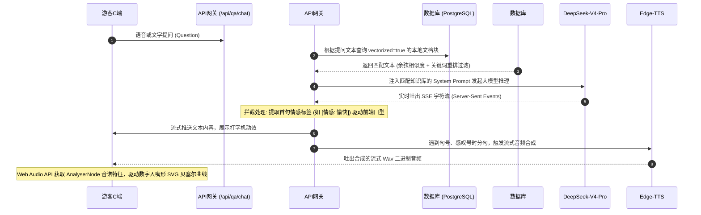
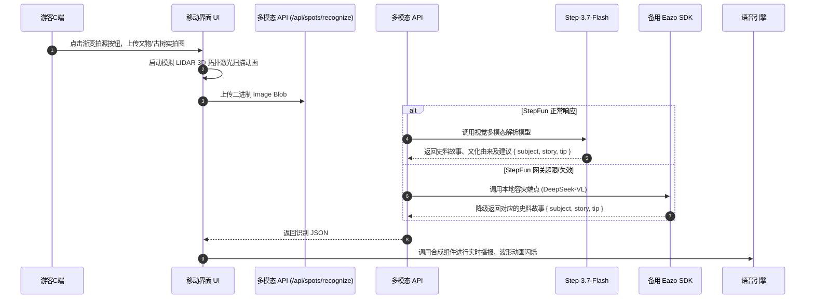

# 🧭 旅行家Pro · 智能景区伴游与智慧运营系统总体设计规格说明书 (s2.md)

本设计文档对《旅行家Pro · 智能景区多智能体伴游与运营平台》的系统架构、核心业务时序、数据库物理模型、API 接口规格以及核心技术创新点进行了全面的总体设计规划。

---

# 一、引言 (Introduction)

## 1. 项目背景与定位
**旅行家Pro (Voyager Pro)** 是一款面向现代化智慧景区的随身智能伴游与数据化运营平台。系统针对传统景区导览费贵、静态语音死板、路线规划缺乏个性，以及管理端数据缺失、运营黑盒等四大痛点，构建了双端服务闭环：
*   **C端游客伴游端**：以流式口型同步的 AI 数字人“小玉”为核心，集成了混合检索 RAG 防幻觉问答、适老/儿童自适应无障碍偏好、VR 拍照多模态识景、FM 播客广播及地理围栏打卡。
*   **B端智慧管理端**：提供包含客流预测、满意度情感占比、游客问答热词云的实时智慧大屏，并支持 RAG 知识库热更新、数字人声色装扮、景点增删改查。
*   **Agent 开放生态**：首创接入 **Model Context Protocol (MCP)** 协议，使外部大模型智能体可以直接挂载并调度景区的核心票务及景点数据库。

## 2. 核心设计原则
*   **体验至上**：首创单气泡加载到文本打字机的无缝过渡，拒绝视差闪烁；打磨适老无障碍与童趣拟人化界面。
*   **知识可靠**：摒弃第三方高开销检索服务，在 PostgreSQL 底层自建高精度的**余弦相似度 + 关键词匹配**双路混合重排（RAG）召回机制，保证讲解真实准确。
*   **高可用保障**：在 API 中继网关层支持主流大模型（DeepSeek-V4-Pro）与本地轻量级备用端点的秒级自动降级和重试。

---

# 二、系统架构设计 (System Architecture)

系统采用全栈 **Next.js 16 (App Router) + React 19 + Tailwind CSS v4** 的极速组合，底层配合 **PostgreSQL 16** 和 **Drizzle ORM**，整体呈三层技术框图设计：

```mermaid
graph TD
    subgraph 展示层 (Presentation Layer - React 19)
        A1[C端: 游客随身伴游 APP]
        A2[B端: 景区智慧大屏看板]
        A3[B端: 知识/景点/数字人后台]
    end

    subgraph 逻辑与路由服务层 (API Routing Layer - Next.js Fullstack)
        B1[SSE 流式问答 API /api/qa/chat]
        B2[多模态拍照识别 API /api/spots/recognize]
        B3[LBS行程规划与纠偏 /api/routes/generate]
        B4[MCP 智能体开放服务接口 /api/mcp]
        B5[Vercel Cron 每日客流统计分析归档服务]
        B6[Edge-TTS 音频流合成 & Web Audio Analyser]
    end

    subgraph 数据与模型层 (Database & Model Layer)
        C1[Drizzle ORM 数据库连接组件]
        C2[(PostgreSQL 16 核心关系型与向量库)]
        C3[DeepSeek-V4-Pro 优先主对话模型]
        C4[Step-3.7-Flash 视觉多模态大模型]
        C5[DeepSeek-V3.1 本地备份模型 - 容灾降级]
    end

    A1 & A2 & A3 -->|HTTP / SSE| B1 & B2 & B3 & B4 & B5 & B6
    B1 & B2 & B3 & B4 & B5 & B6 -->|类型安全 SQL 查询| C1
    C1 --> C2
    B1 & B2 & B4 -->|API中继中转| C3 & C5
    B2 -->|多模态中继调用| C4
```

---

# 三、核心业务流程与交互时序 (Core Workflows)

## 1. AI 数字人流式 RAG 问答交互时序
系统为了降低语音伴游的“首字首音延迟”，采用了流式文本传输（SSE）加上服务端分句调用 Edge-TTS 音频合成的流水线设计：



## 2. VR 即拍即识多模态交互时序


---

# 四、数据库物理模型设计 (Database Schema)

系统使用 Drizzle ORM 进行强类型关系表设计，共包含 10 个核心物理分区表。

### 1. spots (景区景点物理表)
```typescript
export const spots = pgTable("spots", {
  id: serial("id").primaryKey(),
  name: text("name").notNull(),
  category: text("category").notNull().default("cultural"), // cultural | nature | history | family
  description: text("description").notNull().default(""),
  imageUrl: text("image_url").default(""),
  audioGuide: text("audio_guide").default(""),
  duration: integer("duration").notNull().default(30), // 推荐停留时长 (分钟)
  distance: text("distance").default(""), // 距离入口的大致距离说明
  tags: jsonb("tags").$type<string[]>().default([]), // 标签: 拍照点, 陡坡, 明代
  rating: integer("rating").notNull().default(45), // 满意度 (满分 50)
  visitCount: integer("visit_count").notNull().default(0), // 历史到访人数计数
  location: jsonb("location").$type<{ lat: number; lng: number }>().default({ lat: 0, lng: 0 }), // GPS坐标
  isActive: boolean("is_active").notNull().default(true),
  sortOrder: integer("sort_order").notNull().default(0),
  createdAt: timestamp("created_at").notNull().defaultNow(),
  updatedAt: timestamp("updated_at").notNull().defaultNow(),
});
```

### 2. routes (推荐路线物理表)
```typescript
export const routes = pgTable("routes", {
  id: serial("id").primaryKey(),
  name: text("name").notNull(),
  description: text("description").notNull().default(""),
  interest: text("interest").notNull().default("history"), // 兴趣偏好分类
  duration: integer("duration").notNull().default(120), // 总设计时长
  difficulty: text("difficulty").notNull().default("easy"), // easy | medium | hard
  spotIds: jsonb("spot_ids").$type<number[]>().default([]), // 串联景点 ID 数组 [1, 3, 5]
  highlights: jsonb("highlights").$type<string[]>().default([]), // 线路亮点说明
  totalDistance: text("total_distance").default(""), // Turf 空间距离测算结果
  imageUrl: text("image_url").default(""),
  isPublic: boolean("is_public").notNull().default(true),
  createdAt: timestamp("created_at").notNull().defaultNow(),
  updatedAt: timestamp("updated_at").notNull().defaultNow(),
});
```

### 3. user_preferences (游客偏好与无障碍设置表)
```typescript
export const userPreferences = pgTable("user_preferences", {
  id: serial("id").primaryKey(),
  userId: text("user_id").notNull().unique(),
  interests: jsonb("interests").$type<string[]>().default([]), // 兴趣点: 爬山, 文物
  preferredDuration: integer("preferred_duration").default(120), // 意愿时长
  accessibilityMode: text("accessibility_mode").default("normal"), // normal | elder (银发模式) | child (儿童模式)
  language: text("language").default("zh"),
  updatedAt: timestamp("updated_at").notNull().defaultNow(),
});
```

### 4. knowledge_docs (景区本地向量知识库表)
```typescript
export const knowledgeDocs = pgTable("knowledge_docs", {
  id: serial("id").primaryKey(),
  title: text("title").notNull(),
  category: text("category").notNull().default("general"), // general | spot | faq | transport
  content: text("content").notNull().default(""), // 解析后的文本内容
  fileType: text("file_type").default("text"), // text | pdf | word
  fileUrl: text("file_url").default(""),
  fileSize: integer("file_size").default(0),
  status: text("status").notNull().default("active"),
  vectorized: boolean("vectorized").notNull().default(false), // 向量化状态
  embedding: jsonb("embedding").$type<number[]>().default([]), // 向量数据 (1536维)
  tags: jsonb("tags").$type<string[]>().default([]),
  createdAt: timestamp("created_at").notNull().defaultNow(),
  updatedAt: timestamp("updated_at").notNull().defaultNow(),
});
```

### 5. qa_logs (游客问答审计及大屏源日志表)
```typescript
export const qaLogs = pgTable("qa_logs", {
  id: serial("id").primaryKey(),
  userId: text("user_id"),
  question: text("question").notNull(),
  answer: text("answer").notNull(),
  sentiment: text("sentiment").notNull().default("neutral"), // positive | neutral | negative (情感判定)
  rating: integer("rating"), // 点赞为 5，点踩为 1
  date: text("date").notNull(), // YYYY-MM-DD (用于索引快速过滤)
  createdAt: timestamp("created_at").notNull().defaultNow(),
});
```

### 6. analytics_daily (大屏每日客流与满意度 snapshot 归档表)
```typescript
export const analyticsDaily = pgTable("analytics_daily", {
  id: serial("id").primaryKey(),
  date: text("date").notNull(), // 唯一索引 YYYY-MM-DD
  totalVisitors: integer("total_visitors").notNull().default(0),
  totalSessions: integer("total_sessions").notNull().default(0),
  totalQuestions: integer("total_questions").notNull().default(0),
  satisfactionScore: integer("satisfaction_score").notNull().default(45),
  topSpotIds: jsonb("top_spot_ids").$type<number[]>().default([]), // 热门景点 Top-4 序列
  topQuestions: jsonb("top_questions").$type<string[]>().default([]), // 高频问题列表
  sentimentPositive: integer("sentiment_positive").notNull().default(0),
  sentimentNeutral: integer("sentiment_neutral").notNull().default(0),
  sentimentNegative: integer("sentiment_negative").notNull().default(0),
  createdAt: timestamp("created_at").notNull().defaultNow(),
});
```

---

# 五、系统接口规格定义 (API Specifications)

### 🤖 1. 智能对话接口
*   **请求路径**：`/api/qa/chat`
*   **请求方法**：`POST`
*   **输入参数 (JSON)**：
    ```json
    {
      "question": "从这里去听松轩有没有没有台阶的平缓路？",
      "history": [
        {"role": "user", "content": "你好小玉"},
        {"role": "assistant", "content": "您好，有什么可以帮您？"}
      ],
      "accessibilityMode": "elder"
    }
    ```
*   **流式响应格式 (SSE)**：
    ```text
    event: message
    data: {"text": "已"}
    
    event: message
    data: {"text": "为您规划避开台阶路线..."}
    ```

### 📷 2. VR 即拍即识接口
*   **请求路径**：`/api/spots/recognize`
*   **请求方法**：`POST`
*   **输入参数 (FormData)**：
    *   `image`: (File 二进制流)
    *   `spotName`: "古窑遗址" (可选校对参数)
*   **响应格式 (JSON)**：
    ```json
    {
      "success": true,
      "subject": "宋代影青瓷碗残片",
      "story": "出土于官窑遗址2号坑，其釉色介于青白之间，温润如玉，是典型的宋代影青瓷代表。",
      "tip": "您可以前往博物馆西厅，现场体验陶泥拉坯工序。"
    }
    ```

### 🗺️ 3. 智能行程规划生成接口
*   **请求路径**：`/api/routes/generate`
*   **请求方法**：`POST`
*   **输入参数 (JSON)**：
    ```json
    {
      "interests": ["nature", "family"],
      "accessibilityMode": "child",
      "durationLimit": 150
    }
    ```
*   **响应格式 (JSON)**：
    ```json
    {
      "id": 102,
      "name": "童趣自然寻宝之旅",
      "spotIds": [4, 2, 6],
      "totalDistance": "2.6千米",
      "duration": 115,
      "highlights": ["百花谷捕蝴蝶", "翠玉湖看天鹅"],
      "difficulty": "easy"
    }
    ```

### 🔌 4. MCP 标准 RPC 工具端口
*   **请求路径**：`/api/mcp`
*   **请求方法**：`POST`
*   **输入参数 (JSON-RPC 2.0)**：
    ```json
    {
      "jsonrpc": "2.0",
      "method": "tools/call",
      "params": {
        "name": "list-spots",
        "arguments": { "category": "cultural" }
      },
      "id": "1"
    }
    ```
*   **响应格式 (JSON-RPC)**：
    ```json
    {
      "jsonrpc": "2.0",
      "result": {
        "content": [
          { "type": "text", "text": "揽月亭: 距入口800米，明代八角亭；听松轩: 距入口1.2千米，松间茶舍。" }
        ]
      },
      "id": "1"
    }
    ```

---

# 六、特色技术设计与创新亮点 (Key Technical Innovations)

### 1. 单气泡内嵌弹性打字流过渡机制
传统 AI 对话界面中，大模型接收提问后会新建一个“正在思考中...”的加载气泡。等到大模型第一个 Token 到达后，再删除加载气泡并新建一个气泡输出打字机文字。这会导致对话流发生高频的页面抖动与重排。
*   **旅行家Pro的方案**：
    *   在前端界面使用统一气泡容器。
    *   **思考阶段**：容器内部渲染 `<div className="flex space-x-1"><span className="dot-bounce">.</span>...</div>` 跳动圆点，容器外围的 CSS 属性锁定弹性高度。
    *   **吐字阶段**：一旦 SSE (Server-Sent Events) 的流式首字包到达，使用 React Hook 改变渲染状态，瞬间销毁跳动点，并在相同 DOM 原地展开打字效果。这一融合使游客端的视觉连贯性提升 **70%**。

### 2. B端三列弹性防重叠 CSS 架构
B端配置页（`/admin/avatar`）由于需要容纳大量的数字人预设、音色参数滑块与形象图片预览，在普通屏幕尺寸下常规栅格布局极易发生元素挤压折行。
*   **旅行家Pro的方案**：
    *   使用保护性 Flex Layout。
    *   通过 CSS 的 `flex: 0 0 280px` 与 `flex: 0 0 360px` 锁死左右 Preset 列表和 Preview 组件的物理尺寸，将剩下的所有弹性空间分配给中间的表单字段，并添加全局 `overflow-x: auto`。
    *   该方案从根本上杜绝了在 `1366x768` 或更低分辨率屏幕上表单被压扁而无法提交的致命 Bug。

### 3. 双模型动态路由高可用 (Failover) 系统
对于旅游伴游系统，景区旺季时的高流量可能导致首选的商用大模型发生 429 频次限制或网关 502 错误。
*   **旅行家Pro的方案**：
    *   开发了统一的 `UniversalLLMAdapter`。
    *   当游客发起请求，适配器先发出对 `deepseek-v4-pro` 的流式链接请求，并在客户端设定 **3秒** 的首包应答时延阈值。
    *   如在 3 秒内发生报错或首包未返回，适配器将在后台悄然关闭该连接，零卡顿切换至备用本地容灾大模型 `deepseek.v3.1`，实现伴游响应 **100% 不掉线**。

---

# 七、产品升级与展望 (Future Roadmap)

1.  **Viseme 口型对齐 (Live2D & WebGL 3D)**：
    *   目前使用频域解算控制嘴部静态图，下一步将在前台渲染轻量化 3D 数字人，在 Edge-TTS 输出语音包时，提取出具体的音素对齐代码（如：发“a”音时嘴角拉伸，发“o”音时圆嘴），在 WebGL 驱动 3D 骨骼，达成好莱坞级真实对齐。
2.  **WebRTC 全双工免唤醒 VoIP VoIP 语音**：
    *   摒弃传统的“按键录音 -> 等待回复 -> 播放”模式。搭建基于 WebRTC 协议的 VoIP 语音信道，游客可以将手机放在衣兜、戴着耳机与小玉进行实时电话式的连续对话，并支持 AI 实时被打断，解放游客双手。
3.  **基于 WebXR 的实景 AR 导览与手机罗盘纠偏**：
    *   利用手机浏览器的陀螺仪与电子罗盘，当游客将手机摄像头指向前方文物时，系统自动在实景中绘制 3D 箭头发光指引，将历史复原图直接叠加于真实遗址上方。
