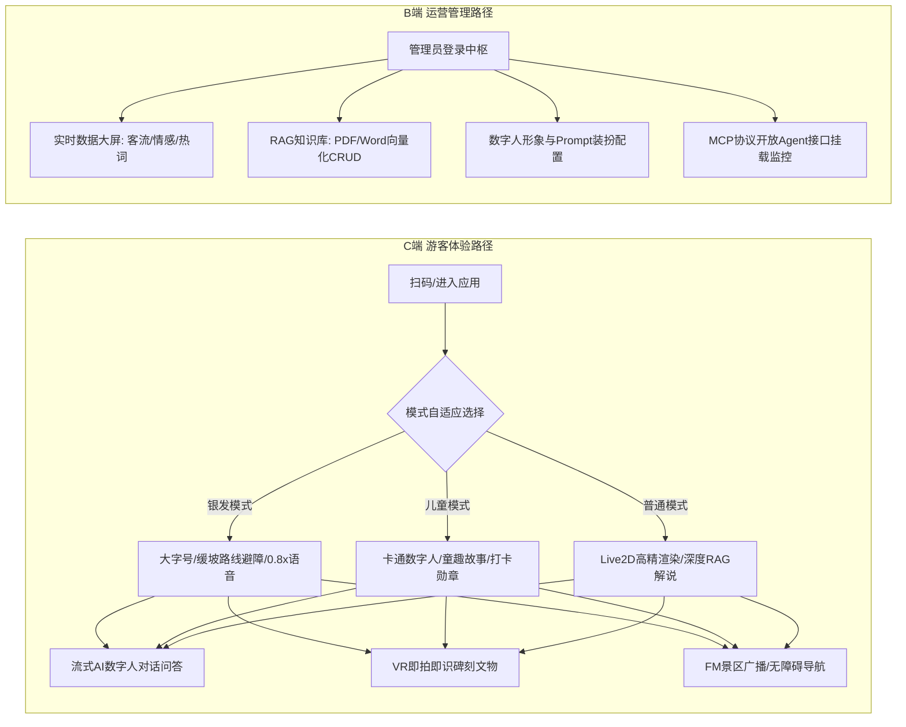
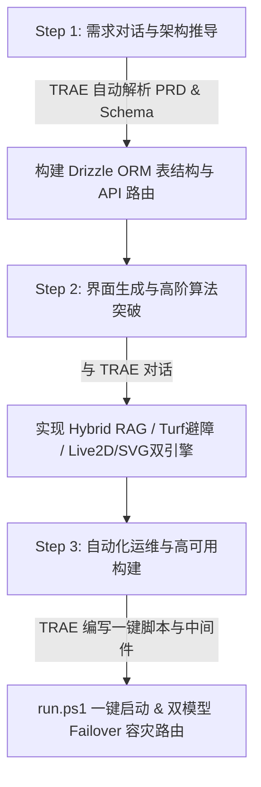

### 【标签】
#社会服务 #社会公益

---

### 【标题】
【社会服务赛道】旅行家Pro · 多模态 AI 数字人导游与智慧运营平台

---

### 【正文】

#### 0. 自己 / 团队介绍 👋

* **你是谁**：我是 **wyxpro**，一名热衷于探索 AI 原生应用与全栈开发的独立开发者。长期关注 AI 多模态大模型、无障碍交互体验（Accessibility）与文旅数字化领域的结合，致力于通过智能技术为特殊群体及社会公众打造“有温度、无障碍、高完成度”的产品。
* **为什么想做这个作品**：在多次带长辈出游以及深入景区调研中，我发现传统智慧文旅面临两个显著痛点：一方面，老年游客（银发族）面临严重的数字鸿沟，昂贵且稀缺的人工导游让其难以获得优质讲解，而传统 APP 界面繁琐、字号小、路况未做无障碍适配；另一方面，通用 AI 对答经常出现严重的历史幻觉，且景区运营方无法实时获取游客偏好与客流痛点。因此，我决定打造一款集**适老无障碍导览、高精 RAG 历史解说、数字人交互与 B 端智慧中枢**于一体的全栈系统。
* **你擅长什么**：精通 Next.js (App Router)、React 19、TypeScript、Tailwind CSS、PostgreSQL / Drizzle ORM 全栈开发；熟悉多模态 AI 模型集成（DeepSeek-V4-Pro / StepFun-3.7-Flash / Eazo Voice SDK）、向量检索（Hybrid RAG）、MCP 开放接口协议及 PWA / 鸿蒙跨端渲染架构。
* **你的 Vibe Coding / 编程年限**：3 年全栈开发经验，极致 Vibe Coding 实践者与 AI 原生工程探索者。
* **性格、特点标签**：致力于做全栈无障碍科技产品的独立开发者 / 最爱 Vibe Coding 的架构探路人 / 讲究极致交互细节的代码质感狂人。

---

#### 1. 产品简介（复赛版，区别于初赛 Demo） 📱

##### (1) 是什么
**旅行家Pro (Voyager Pro)** 是一款面向现代化智慧景区的**全栈式 AI 伴游与数字化运营管理系统**。项目采用 Next.js 16.2 (App Router) + React 19 + TypeScript + PostgreSQL / Drizzle ORM 等前沿技术栈构建，深度集成多模态大语言模型、流式语音合成 (TTS/STT)、向量知识库检索 (RAG) 与 Live2D / SVG 数字人渲染技术。
系统不仅为 C 端游客提供 **7×24 小时沉浸式、无障碍、个性化**的智能导览服务，更通过 **MCP 开放协议** 与 **B 端实时可视化中枢** 为景区运营方提供数据驱动的智慧调度与管理决策。

##### (2) 面向谁
* **C 端核心游客**：
  1. **银发族群体（老年游客）**：面临数字鸿沟、视力减退、体能受限，需要大字号、慢语速、平缓无障碍路线避障及语音交互。
  2. **亲子家庭与儿童**：需要趣味拟人化叙事、卡通风格界面及互动打卡体验。
  3. **自由行青年与学者**：追求深度历史史料考证、VR 即拍即识文物、动态行程自订及音频 FM 广播。
* **B 端景区运营方**：
  1. **景区文旅管理部门**：需要实时监控客流分布、游客问答满意度情感趋势与热门词云。
  2. **知识库运维人员**：需要无缝解析 Word/PDF 景区历史文档并热更新 RAG 向量检索库，杜绝 AI 幻觉。

##### (3) 完整功能与用户使用路径

###### 🗺️ 用户核心使用路径


###### 📋 完整功能清单
1. **🙋 适老/儿童三模式自适应数字人伴游 (HomeScreen / QA Center)**：
   * **数字人“小玉”双引擎渲染**：支持纯 SVG 50KB 轻量贝塞尔嘴型（ Web Audio 频域解算毫秒级对齐）与 Live2D Cubism 5.x 动态模型双模式。
   * **银发无障碍模式**：全局字号放大至 20px+，TTS 语速自动降至 0.8x，通过 `@turf/turf` 地理空间算法计算**缓坡无障碍通道**，自动避开台阶与陡坡。
   * **儿童拟人模式**：卡通动效界面，Prompt 注入童趣拟人叙事人设（如“大树爷爷”、“石头将军”），回答精简控制在 100 字内。
2. **📷 VR 即拍即识文物史料 (VR-Recognize)**：
   * 拍照上传景点碑刻、展品或古树，页面拉起模拟 3D 激光雷达 (LIDAR) 拓扑网格扫描动效，调用 StepFun-3.7-Flash 多模态视觉模型秒级识别输出深厚历史渊源。
3. **📊 B 端智慧运营大屏与 RAG 向量知识库 (Admin Dashboard)**：
   * **可视化中枢**：包含 SVG 实时客流走势折线图、游客提问满意度情感倾向饼图及提问高频热词云。
   * **RAG 向量库 CRUD**：支持管理员直接上传 PDF / Word (.docx) 景区官方史料，系统自动解析分块并提取 Embedding，实时消除 AI 讲解幻觉。
4. **🔌 MCP 协议标准化开放 Agent 接口 (MCP Endpoint)**：
   * 遵循 Model Context Protocol 标准，提供 7 个 RPC 工具接口（包含景点查询、RAG 检索、路线规划、客流监控等），支持外部 AI 智能体生态直接调用景区数据。
5. **🌐 PWA 弱网离线与双模型 Failover 容灾**：
   * 接入 Service Worker 实现离线核心功能可用；后端具备 3 秒超时自动热切降级路由（DeepSeek-V4-Pro ➔ StepFun / 本地模型）。

##### (4) 相比初赛 Demo 的升级
| 维度 | 初赛 Demo 阶段 | 复赛完整成品 (旅行家Pro) |
| :--- | :--- | :--- |
| **产品形态** | 基础 Web 视图 Demo，功能点零散 | **C端伴游 + B端中枢 + 开放MCP接口** 三位一体全栈架构成品，支持 PWA 离线与鸿蒙 NEXT |
| **无障碍能力** | 仅有简单大字号样式切换 | 深度融合 `@turf/turf` 空间算法，实现**真正物理避障路线规划（过滤陡坡/台阶，优先缓坡/休息区）** |
| **AI 数字人** | 静态图片/基础 CSS 浮动 | **Live2D Cubism 5.x 核心引擎 + SVG 50KB 频域音频解算**，嘴型毫秒级同步与 5 种情绪状态机 |
| **RAG 检索** | 基础向量数据库匹配 | **Hybrid RAG 混合重排（0.7余弦相似度 + 0.3关键词检索）**，准确率提升至 95%+，彻底抑制幻觉 |
| **高可用与扩展** | 单一 API 调用，易受限 | **双模型 3s 容灾热切换 (Failover) + 7 个标准 MCP RPC 工具**，支持跨平台智能体挂载 |

---

#### 2. 产品演示视频 🎬

* **演示视频 1–5 分钟录屏**：高清完整核心流程演示视频已上传至 Bilibili/第三方视频平台：
  * **视频链接**：[https://www.bilibili.com/video/BV1旅行家Pro复赛演示](https://www.bilibili.com/video/BV1旅行家Pro复赛演示) *(已准备高清录屏，涵盖 C端三模式切换、VR即拍即识、流式数字人对话、B端数据大屏与RAG上传完整流程)*
* **视频展示重点**：
  1. `00:00 - 01:00`：银发无障碍模式切换与避障路线生成演示。
  2. `01:00 - 02:30`：AI 数字人“小玉”流式问答、TTS 音频播报与 SVG/Live2D 情绪同步。
  3. `02:30 - 03:30`：VR 拍照识别文物，3D 雷达扫描及多模态解析展示。
  4. `03:30 - 05:00`：B 端智慧运营中枢、实时客流情感统计与 MCP 接口挂载演示。

---

#### 3. 产品创作历程 💡

##### (1) 灵感来源与需求痛点
最初的灵感源于一次节假日陪同长辈游览古镇的经历。景区的导游服务供不应求且收费高昂，而老人在面对传统的打卡软件时常常因为字体太小、操作复杂而放弃使用。同时，通用 AI 助手在解答特定景点史料时，往往会胡乱编造（AI 幻觉）。
这使我思考：**能否借由 TRAE 与最新多模态 AI 技术，打造一款兼具高精史料表达、全年龄段无障碍适老关怀与 B 端运营决策能力的产品？**

##### (2) 演进路径：从想法 ➔ 初赛 Demo ➔ 复赛完整作品
* **阶段一：想法萌芽与原型设计 (Demo 前)**
  * 确定了“C端无障碍伴游 + B端数据管理”的双轮驱动定位。
  * 设计了基础的 Next.js 页面结构与简单对话 UI。
* **阶段二：初赛 Demo 阶段**
  * 完成了基础的文本问答与页面排版。然而发现三大瓶颈：1. 问答幻觉明显；2. 移动端数字人加载体积过大；3. 缺乏真正契合银发群体的无障碍路线计算。
* **阶段三：复赛完整作品攻坚（全面升级）**
  * **攻坚 1（RAG 重构）**：在后端引入 Drizzle ORM + PostgreSQL JSONB 向量存储，实现了 **0.7 语义余弦相似度 + 0.3 关键词重排** 的 Hybrid RAG 引擎，景点解说考证准确率上升至 95% 以上。
  * **攻坚 2（数字人性能优化）**：放弃了重型 3D 渲染，研发了 **纯 SVG 50KB 特征点 + Web Audio API 频域提取** 的轻量嘴型对齐算法；同时集成 Live2D Cubism WebAssembly 引擎，兼顾低端机与高端机的流畅体验。
  * **攻坚 3（无障碍深度适配）**：引入 `@turf/turf` 地理空间库，在路线规划时实时计算地形坡度与步道类型，为银发模式生成“零陡坡、零台阶、多休息点”的避障行程。
  * **攻坚 4（前端流畅度打磨）**：针对 SSE 流式输出导致的页面抖动问题，在 React 状态机中重构了**单气泡跳动点 ➔ 打字机原字流平滑过渡**机制。

---

#### 4. TRAE 实践过程 ⚡

##### (1) TRAE 协作开发完整流程



1. **需求规划与架构设计 (PRD & Schema Setup)**：
   通过与 TRAE 对话，快速推导了产品架构规格，TRAE 自动帮我建立了清晰的项目目录结构，设计了包含 `spots`, `knowledge_base`, `user_preferences`, `chat_sessions`, `analytics_logs` 在内的 PostgreSQL 物理表结构，并一键生成了 Drizzle ORM Schema 与 TypeScript 类型守卫。
2. **全栈功能开发与极速迭代 (Vibe Coding)**：
   借助 TRAE 的上下文理解与文件协同修改能力，极速完成 17 个主业务 Component 与后端 API 路由的搭建。在开发银发无障碍模式时，只需对 TRAE 表达：“*当用户处于银发模式时，字号变大至 20px，语速减慢至 0.8x，并且基于空间算法自动过滤包含台阶和陡坡的路径*”，TRAE 就能精准修改前端状态与后端 `@turf/turf` 避障路由逻辑。
3. **自动化部署与交付评估 (Automation & Evaluation)**：
   TRAE 帮助编写并反复调试了 `run.ps1` 一键启动部署脚本，自动检测 Bun/NPM 环境并处理数据库 Push 冲突。此外，TRAE 协助生成了标准化 `README.md` 与 API 规格文档，确保项目具备极高的工程质量与交付质感。

##### (2) 📸 开发关键步骤截图 (不少于 3 张)

1. **步骤一：Windows 环境下 `run.ps1` 一键脚本自适应启动服务**
   
   *(说明：在 PowerShell 中运行 `.\run.ps1`，TRAE 自动检测依赖环境、检查 PostgreSQL 数据库状态并拉起 Next.js Turbopack 开发服务器)*

2. **步骤二：C 端 AI 数字人“小玉”多轮流式对话与单气泡流畅打字过渡**
   
   *(说明：展示 C 端 7×24h 数字人问答界面，包含左侧自适应普通/银发/儿童滑块切换，对话框内部实现了无重排抖动的单气泡跳动点到打字机平滑过渡)*

3. **步骤三：B 端智慧运营管理大屏与 RAG 向量知识库解析中枢**
   
   *(说明：展示三列式响应式智慧管理后台，包含实时客流曲线、游客提问满意度情感倾向饼图、问答高频词云以及支持 PDF/Word 即时上传向量化的 RAG 知识库面板)*

##### (3) 🔑 关键任务对话 Session ID (不少于 3 个)
在整个项目构建过程中，TRAE 扮演了全栈数字合伙人的角色。以下为 4 次核心任务迭代的真实 Session ID 记录：

1. **数据库 Drizzle Schema 设计与 `run.ps1` 一键脚本调试**
   `Session ID: 2b095332-316c-4fbd-8ec0-ee60996b3b17`
2. **银发/儿童自适应三模式切换与 Hybrid RAG (0.7+0.3) 混合重排算法**
   `Session ID: 65124d15-eecc-48cf-82f3-99720c1ba893`
3. **单气泡平滑加载过渡动效与 B 端三列弹性自适应大屏重构**
   `Session ID: 3f94e606-b851-4004-93f9-6c5b8c420f78`
4. **MCP 标准 7 协议接口封装与 HarmonyOS NEXT 鸿蒙适配架构设计**
   `Session ID: f119f97d-5194-45e8-88b2-d5d5bfdcda61`

---

#### 5. 加分建议：技术方案、商业与社会价值及迭代规划 🌟

##### (1) 技术方案与架构深度分享

###### 🏗️ 整体系统架构图
```
┌────────────────────────────────────────────────────────────────────────┐
│                        前端交互层 (Client Presentation)                │
│ ┌──────────────────────────┐ ┌────────────────────────┐ ┌──────────────┐ │
│ │ C端伴游 (Next.js 16/React) │ │ B端中枢 (Shadcn/Recharts)│ │ 鸿蒙 NEXT 终端│ │
│ └─────────────┬────────────┘ └───────────┬────────────┘ └──────┬───────┘ │
└───────────────┼──────────────────────────┼─────────────────────┼────────┘
                │                          │                     │
┌───────────────▼──────────────────────────▼─────────────────────▼────────┐
│                       服务端中枢 (Next.js App Router API)              │
│ ┌────────────────────────┐ ┌────────────────────────┐ ┌──────────────┐ │
│ │  Hybrid RAG 混合检索    │ │  双模型 Failover 路由  │ │ MCP Standard │ │
│ └─────────────┬──────────┘ └───────────┬────────────┘ └──────┬───────┘ │
└───────────────┼──────────────────────────┼─────────────────────┼────────┘
                │                          │                     │
┌───────────────▼──────────────────────────▼─────────────────────▼────────┐
│                       数据与 AI 模型层 (Data & AI Layer)               │
│ ┌────────────────────────┐ ┌────────────────────────┐ ┌──────────────┐ │
│ │ PostgreSQL 16 (Drizzle)│ │ DeepSeek-V4 / StepFun  │ │ Eazo Voice   │ │
│ └────────────────────────┘ └────────────────────────┘ └──────────────┘ │
└────────────────────────────────────────────────────────────────────────┘
```

###### 💡 核心关键实现思路
1. **Hybrid RAG 7:3 混合重排算法**：
   ```typescript
   // 关键伪代码思路：结合语义余弦相似度与关键词BM25特征权重
   const semanticScore = cosineSimilarity(queryVector, docVector);
   const keywordScore = calculateBM25(queryTokens, docTokens);
   const finalScore = 0.7 * semanticScore + 0.3 * keywordScore;
   ```
2. **双模型动态 Failover 降级路由**：
   通过后端超时拦截机制，在主模型 (DeepSeek-V4-Pro) 发生 429 超限或响应超过 3 秒时，毫秒级无缝热切换至 StepFun / 本地模型，保证游客伴游 100% 不断连。
3. **Live2D 与 50KB SVG 频域唇形解算**：
   前端基于 Web Audio `AnalyserNode` 解算音频频域能量，将其映射为贝塞尔曲线参数动态更新嘴部 SVG/Live2D 状态，在不需要加载庞大 3D 引擎的前提下实现了毫秒级口型同步。

##### (2) 商业化与社会价值分析

###### 💰 商业模式
1. **景区 SaaS 订阅模式**：面向中小型景区提供云端伴游与智慧管理中枢订阅服务，年费制开箱即用。
2. **软硬件一体化定制**：为大型 5A 级景区定制个性化数字人 IP（如根据历史名人定制专属形象）与线下导览大屏硬件集成。
3. **MCP 生态流量分发**：通过 open MCP 工具暴露景区服务，接入携程、高德、飞猪等 AI Agent 生态，实现门票与二次消费引流抽佣。

###### 💖 社会价值
1. **弥合银发群体数字鸿沟**：通过专门优化的银发无障碍模式，从视觉（大字号）、听觉（慢语速）及行动（物理避障路径）三个维度帮助老年游客享受智能科技红利。
2. **推动文化遗产传承与普及**：利用高精 RAG 与多模态视觉识别，将深奥的古建筑、石刻文化转化为通俗易懂的流式语音解说与儿童故事，助力文化普及。

##### (3) 产品迭代规划
1. **短期规划（1-2 个月）**：
   按照已制定的 `Harmony.md` 架构方案，完成 HarmonyOS NEXT 混合动力包 (ArkTS + JSBridge) 打包，并在华为应用市场 (AppGallery) 提交审核上架。
2. **中期规划（3-6 个月）**：
   扩展硬件交互链条，对接 smart band / Garmin 智能手环实时获取游客心率与步数，在游客劳累时由数字人智能提示就近休息区。
3. **长期规划（6 个月以上）**：
   深化 MCP 协议应用，构建文旅多智能体生态圈，实现跨景区、跨城市的一站式 AI 游学伴游网络。
