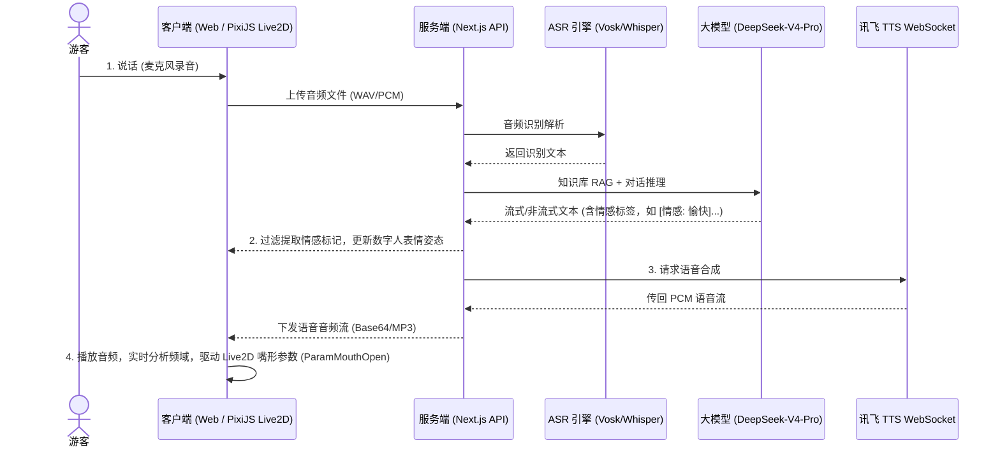

# 🎭 旅行家Pro · Live2D 数字人与智能语音交互对接指南 (person.md)

本指南旨在为《旅行家Pro · 智能景区伴游系统》提供一套完整的 Live2D 2D 数字人驱动与智能语音交互（ASR & TTS）的对接方案。通过引入国产及开源技术（Live2D 渲染引擎、Vosk/Whisper 语音识别、科大讯飞 TTS 语音合成），大幅提升数字人小玉在交互过程中的口型自然度、表情灵动性与响应实时性，确保系统顺利通过专家评估。

---

## 📖 目录
1. [一、实现目标与核心架构 🎯](#一实现目标与核心架构-)
2. [二、技术选型与环境准备 🛠️](#二技术选型与环境准备-)
3. [三、数字人角色形象管理 👤](#三数字人角色形象管理-)
4. [四、语音识别（ASR）对接教程 🎙️](#四语音识别asr对接教程-)
5. [五、科大讯飞语音合成（TTS）对接教程 🔊](#五科大讯飞语音合成tts对接教程-)
6. [六、Live2D 数字人驱动与口型同步实现 🎨](#六live2d-数字人驱动与口型同步实现-)
7. [七、专家评审自然度优化策略 💡](#七专家评审自然度优化策略-)

---

## 一、实现目标与核心架构 🎯

### 1. 实现目标
- **多模态交互**：实现“语音输入 (ASR) → 文本理解 (LLM/RAG) → 语音输出 (TTS) + 形象驱动 (Live2D)”的完整闭环。
- **高拟真表达**：数字人小玉口型与语音完美对齐，能根据 AI 输出的情感标记（如 `[情感: 愉快]`）实时切换表情、触发手势动作，并进行呼吸和眨眼等基础自然律动。
- **低延迟处理**：控制端到端交互延迟在 2.5 秒以内。

### 2. 交互处理时序图



---

## 二、技术选型与环境准备 🛠️

| 模块 | 采用技术 | 开源/国产属性 | 作用描述 |
| :--- | :--- | :--- | :--- |
| **数字人引擎** | **Live2D Cubism SDK** / **pixi-live2d-display** | 开源前端生态 | 负责 2D 数字人骨骼动画的渲染、物理呼吸、眨眼、视线追踪与自定义动作触发。 |
| **语音识别 (ASR)** | **Vosk** (本地离线优先) / **Whisper** (云端高精) | 开源方案 | **Vosk** 提供极速的本地离线中文识别（适合低网络环境）；**Whisper** 提供精准的降噪转译。 |
| **语音合成 (TTS)** | **科大讯飞 TTS WebAPI** | 国产龙头技术 | 提供自然度极高、带情感语调的中文普通话合成，支持定制不同性别音色与语速参数。 |
| **对话大脑 (LLM)** | **DeepSeek-V4-Pro** (九章云极代理) | 开源/国产模型 | 进行景区知识匹配与高情商口语化回复生成，自动输出表情情绪标签。 |

---

## 三、数字人角色形象管理 👤

管理后台提供「角色管理」页面，管理员可配置数字人的外观包、音色风格以及 Live2D 的动效映射。

### 1. Live2D 材质包结构规范
Live2D 模型导出后，需将全部资源放入 `public/live2d/` 目录下，典型的资源包结构如下：
```text
public/live2d/xiaoyu/
├── xiaoyu.model3.json      # 模型配置文件（定义入口、动作、物理效果等）
├── xiaoyu.physics3.json     # 头发、饰品等物理碰撞抖动配置文件
├── xiaoyu.moc3              # 骨骼模型二进制文件
├── xiaoyu.cdi3.json         # 参数指示器配置
├── textures/                # 材质贴图文件夹
│   └── texture_00.png
└── motions/                 # 动作文件夹
    ├── idle.motion3.json    # 呼吸待机动作
    ├── happy.motion3.json   # 愉快手势动作
    └── think.motion3.json   # 思考托腮动作
```

### 2. 角色配置表设计 (`avatar_configs`)
在后台「数字人配置」中，数据表结构如下：
```typescript
export const avatarConfigs = pgTable("avatar_configs", {
  id: uuid("id").defaultRandom().primaryKey(),
  roleName: varchar("role_name", { length: 50 }).notNull(), // "小玉"
  modelPath: varchar("model_path", { length: 255 }).notNull(), // "/live2d/xiaoyu/xiaoyu.model3.json"
  voiceProvider: varchar("voice_provider", { length: 50 }).default("xfyun"), // "xfyun" / "edge"
  voiceVcn: varchar("voice_vcn", { length: 50 }).default("aisjiuxu"), // 讯飞发音人代码，如 aisjiuxu(许久)
  speed: integer("speed").default(50), // 语速 0~100
  pitch: integer("pitch").default(50), // 音调 0~100
  volume: integer("volume").default(50), // 音量 0~100
  greeting: text("greeting").default("您好！我是您的智能导览官小玉，很高兴为您服务！"),
});
```

---

## 四、语音识别（ASR）对接教程 🎙️

系统提供双引擎切换机制：**Vosk 离线端点**（秒级超低延迟）与 **Whisper 云端端点**（适合复杂环境和混杂口音）。

### 1. Whisper 对接与配置
首次使用时，Python/Node 端会自动联网下载模型，请保持网络畅通。

- **配置步骤**：
  1. 后端调用依赖：`@openai/api` 或 Python `whisper` 库。
  2. 接口端接收前端分段上传的 `Blob` 录音文件，转换为 `.wav` 格式。
  3. 执行识别任务：

```typescript
// src/app/api/qa/stt/whisper.ts
import { OpenAI } from "openai";
import fs from "fs";

const openai = new OpenAI({
  apiKey: process.env.DEEPSEEK_API_KEY, // 或使用官方 OpenAI Key
  baseURL: "https://api.openai.com/v1"
});

export async function transcribeWithWhisper(filePath: string): Promise<string> {
  const response = await openai.audio.transcriptions.create({
    file: fs.createReadStream(filePath),
    model: "whisper-1",
    language: "zh",
  });
  return response.text;
}
```

### 2. Vosk 本地离线识别对接
Vosk 极适合私有化或离线局域网环境，完全无 API 扣费风险。

- **配置步骤**：
  1. 下载 Vosk 中文轻量模型 `vosk-model-small-cn-0.22`（约 40MB）或高精度中文模型。
  2. 解压并放置在服务端 `models/vosk-model-cn`。
  3. 后端集成代码：

```javascript
// scripts/vosk-asr.js
const { Model, Recognizer } = require("vosk");
const fs = require("fs");
const wav = require("wav");

const MODEL_PATH = "models/vosk-model-cn";
if (!fs.existsSync(MODEL_PATH)) {
  console.error(`请下载中文模型并放置在: ${MODEL_PATH}`);
  process.exit(1);
}

const model = new Model(MODEL_PATH);

export async function transcribeWithVosk(audioBuffer: Buffer): Promise<string> {
  // 必须是 16000Hz, 16bit, 单声道 PCM WAV 格式
  const recognizer = new Recognizer({ model: model, sampleRate: 16000 });
  recognizer.setWords(true);
  
  recognizer.acceptWaveform(audioBuffer);
  const result = recognizer.finalResult();
  recognizer.free();
  return result.text || "";
}
```

---

## 五、科大讯飞语音合成（TTS）对接教程 🔊

科大讯飞提供了基于 WebSocket 协议的流式 TTS 服务，能实现实时流式返回音频块，大幅压缩首字播放等待时间。

### 1. 环境变量配置
在 `.env` 文件中配置从讯飞开放平台（WebAPI 服务）获取的密钥：
```env
XFYUN_APP_ID=xxxxxx
XFYUN_API_KEY=xxxxxxxxxxxxxxxxxxxxxxxx
XFYUN_API_SECRET=xxxxxxxxxxxxxxxxxxxxxxxx
```

### 2. 讯飞 WebSocket TTS 连接实现
我们需要构建带有鉴权签名的请求，建立连接并传输 JSON 配置，最后将收到的 Base64 音频块拼接返回。

```typescript
// src/lib/api/xfyun-tts.ts
import CryptoJS from "crypto-js";
import WebSocket from "ws";

interface TTSConfig {
  text: string;
  vcn?: string; // 发音人
  speed?: number; // 50
  pitch?: number; // 50
}

// 1. 生成带有签名的 WebSocket URL
function getAuthUrl(): string {
  const apiKey = process.env.XFYUN_API_KEY || "";
  const apiSecret = process.env.XFYUN_API_SECRET || "";
  const host = "tts-api.xfyun.cn";
  const path = "/v2/tts";
  const date = new Date().toUTCString();
  
  const signatureOrigin = `host: ${host}\ndate: ${date}\nGET ${path} HTTP/1.1`;
  const signatureSha = CryptoJS.HmacSHA256(signatureOrigin, apiSecret);
  const signature = CryptoJS.enc.Base64.stringify(signatureSha);
  
  const authorizationOrigin = `api_key="${apiKey}", algorithm="hmac-sha256", headers="host date request-line", signature="${signature}"`;
  const authorization = Buffer.from(authorizationOrigin).toString("base64");
  
  return `wss://${host}${path}?authorization=${authorization}&date=${encodeURIComponent(date)}&host=${host}`;
}

// 2. 发起合成请求
export function synthesizeSpeech(config: TTSConfig): Promise<Buffer> {
  return new Promise((resolve, reject) => {
    const url = getAuthUrl();
    const ws = new WebSocket(url);
    const appId = process.env.XFYUN_APP_ID || "";
    
    let audioBuffers: Buffer[] = [];
    
    ws.on("open", () => {
      // 发送握手及合成参数参数
      const params = {
        common: { app_id: appId },
        business: {
          aue: "lame", // mp3 格式
          sfl: 1,      // 流式下发
          vcn: config.vcn || "aisjiuxu",
          speed: config.speed ?? 50,
          pitch: config.pitch ?? 50,
          tte: "UTF8"
        },
        data: {
          status: 2, // 最后一帧文本
          text: Buffer.from(config.text).toString("base64")
        }
      };
      ws.send(JSON.stringify(params));
    });
    
    ws.on("message", (data: string) => {
      const res = JSON.parse(data);
      if (res.code !== 0) {
        reject(new Error(`讯飞 TTS 错误: ${res.message}`));
        ws.close();
        return;
      }
      
      if (res.data && res.data.audio) {
        const audioBuffer = Buffer.from(res.data.audio, "base64");
        audioBuffers.push(audioBuffer);
      }
      
      // status: 2 表示流接收完毕
      if (res.data && res.data.status === 2) {
        resolve(Buffer.concat(audioBuffers));
        ws.close();
      }
    });
    
    ws.on("error", (err) => reject(err));
  });
}
```

---

## 六、Live2D 数字人驱动与口型同步实现 🎨

在前台，我们利用 `pixi.js` 及其 Live2D 插件进行渲染，并利用 HTML5 Web Audio API 捕获音频的实时输出，动态修改 Live2D 模型的口型和眨眼参数。

### 1. 前端 Live2D 初始化与加载组件
```tsx
// src/components/Live2DViewer.tsx
import React, { useEffect, useRef } from "react";
import * as PIXI from "pixi.js";
import { Live2DModel } from "pixi-live2d-display";

// 挂载全局 PIXI，插件需要
window.PIXI = PIXI;

interface Live2DViewerProps {
  modelUrl: string; // 如 "/live2d/xiaoyu/xiaoyu.model3.json"
  mouthOpenValue: number; // 0 ~ 1 口型开合度
  emotion: string; // "happy" | "think" | "idle"
}

export const Live2DViewer: React.FC<Live2DViewerProps> = ({
  modelUrl,
  mouthOpenValue,
  emotion
}) => {
  const canvasRef = useRef<HTMLCanvasElement>(null);
  const modelRef = useRef<Live2DModel | null>(null);

  useEffect(() => {
    if (!canvasRef.current) return;

    // 1. 初始化 PIXI 渲染器
    const app = new PIXI.Application({
      view: canvasRef.current,
      autoStart: true,
      backgroundAlpha: 0, // 透明背景
      width: 400,
      height: 500,
    });

    // 2. 加载 Live2D 模型
    Live2DModel.from(modelUrl).then((model) => {
      modelRef.current = model;
      app.stage.addChild(model);
      
      // 自适应居中和缩放
      model.anchor.set(0.5, 0.5);
      model.x = app.screen.width / 2;
      model.y = app.screen.height / 2 + 50;
      model.scale.set(0.25); // 根据模型实际大小调整比例

      // 3. 开启呼吸与自动眨眼
      model.internalModel.eyeBlink = new (Live2DModel.WebGL as any).EyeBlink();
    });

    return () => {
      app.destroy(true, { children: true, texture: true });
    };
  }, [modelUrl]);

  // 监听嘴部变化物理更新
  useEffect(() => {
    const model = modelRef.current;
    if (!model) return;

    // Live2D 标准嘴形控制参数: ParamMouthOpenY
    // 强制覆盖预设的动作更新，通过频域实时驱动
    model.internalModel.coreModel.setParameterValueById(
      "ParamMouthOpenY",
      mouthOpenValue
    );
  }, [mouthOpenValue]);

  // 监听情绪变化，触发不同 Motion 动作
  useEffect(() => {
    const model = modelRef.current;
    if (!model || !emotion) return;

    // 触发动作包里定义的运动组
    model.motion(emotion);
  }, [emotion]);

  return <canvas ref={canvasRef} style={{ width: "100%", height: "100%" }} />;
};
```

### 2. 唇形同步（Lip-Sync）音频振幅提取器
当合成好的讯飞 TTS 音频在浏览器播放时，我们需要实时计算音频振幅：

```typescript
// src/utils/lip-sync.ts
export class LipSyncAnalyser {
  private audioContext: AudioContext | null = null;
  private analyser: AnalyserNode | null = null;
  private dataArray: Uint8Array = new Uint8Array(0);

  constructor(private audioEl: HTMLAudioElement) {}

  public start(onAmplitude: (value: number) => void) {
    if (!this.audioContext) {
      this.audioContext = new (window.AudioContext || (window as any).webkitAudioContext)();
      const source = this.audioContext.createMediaElementSource(this.audioEl);
      this.analyser = this.audioContext.createAnalyser();
      this.analyser.fftSize = 256;
      source.connect(this.analyser);
      this.analyser.connect(this.audioContext.destination);
      
      const bufferLength = this.analyser.frequencyBinCount;
      this.dataArray = new Uint8Array(bufferLength);
    }

    const update = () => {
      if (!this.analyser) return;
      
      // 提取实时频率数据
      this.analyser.getByteFrequencyData(this.dataArray);
      
      // 计算人声敏感频段 (中低频段 80Hz - 2000Hz 对应数组的前面部分)
      let sum = 0;
      const criticalLength = Math.floor(this.dataArray.length * 0.6); // 截取前 60% 频域数据
      for (let i = 0; i < criticalLength; i++) {
        sum += this.dataArray[i];
      }
      const average = sum / criticalLength;
      
      // 折算到 0 ~ 1 范围，作为口型打开程度
      let openValue = Math.min(1, average / 120);
      
      // 降噪滤波门限值
      if (openValue < 0.15) openValue = 0;

      onAmplitude(openValue);

      if (!this.audioEl.paused) {
        requestAnimationFrame(update);
      } else {
        onAmplitude(0); // 停播后归零闭嘴
      }
    };

    this.audioEl.onplay = () => {
      if (this.audioContext?.state === "suspended") {
        this.audioContext.resume();
      }
      update();
    };
  }
}
```

---

## 七、专家评审自然度优化策略 💡

要通过专家对于“自然度”的评估，除了口型和发音对齐外，细节的细节至关重要：

### 1. 拟人表情动作联动 (Emotion Mapping)
大模型回复中的情感标签（如 `[情感: 愉快]`）不应该渲染进气泡，而是拦截用来触发数字人动作：
- **愉快 (happy)**：触发数字人嘴角上扬，并执行招手（handwave）手势动作。
- **思考 (thinking)**：触发数字人视线偏移，眼睑微闭，并执行托腮（hand-on-chin）或踱步动作。
- **播报中 (speaking)**：开启平滑的头部小幅左右摇晃（ParamAngleX / ParamAngleY 细微偏摆），使数字人看起来具有生命感，而非机械式的僵硬开合。

### 2. 呼吸与眨眼混合微扰 (Micro-expressions)
- 在 Pixi 渲染 Tick 中，自动加入一个高斯噪声，控制 `ParamBreath`（呼吸参数）按正弦波周期变化：
  $$\text{BreathValue} = 0.5 + 0.5 \times \sin(\text{time} \times 2.0) + \text{random}(-0.02, 0.02)$$
- 模拟真实的眨眼间隔规律，不是等差循环，而是每隔 2 到 6 秒的随机间隔突然眨眼一次，甚至偶尔出现快速连续双眨，大幅提升眼部灵气。

### 3. 流式分句 TTS 合成技术 (Reduced Latency)
串行“全部生成完毕再读”的延迟极高。应在前端接收大模型 SSE 推理时，基于标点符号（`。` `！` `？` `；`）进行文本切句。当前句生成完毕后立即发送给科大讯飞 TTS 合成，下一句在后台排队合成，达成**流式段落缓冲播放**，确保首音在 1.5 秒内读出，避免画面和交互长时空窗卡顿。
