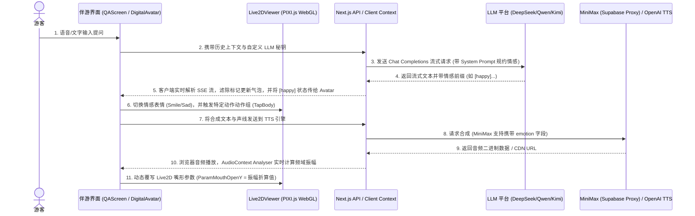

# 🎭 旅行家Pro · Live2D 数字人形象迁移与多模态交互系统实施方案 (persom1.md)

本方案旨在将 `2Dlive-master` 项目中的 **2D Live AI 数字人** 形象及配套的多模态交互系统（支持通用 OpenAI 兼容 LLM 及多 TTS 语音合成）完整迁移合并到当前项目《旅行家Pro · 智能景区伴游系统》中，使虚拟数字人拥有更丰富的表现力与高度自定义的语音、大脑配置能力。

---

## 📖 目录
1. [一、 迁移目标与系统架构 🎯](#一-迁移目标与系统架构-)
2. [二、 技术栈变更与依赖准备 🛠️](#二-技术栈变更与依赖准备-)
3. [三、 详细迁移实施步骤 🚀](#三-详细迁移实施步骤-)
   - [第一步：基础依赖库安装](#第一步基础依赖库安装)
   - [第二步：Live2D WebGL 渲染引擎移植](#第二步live2d-webgl-渲染引擎移植)
   - [第三步：形象库数据管理与 API 配置](#第三步形象库数据管理与-api-配置)
   - [第四步：前端选择弹窗与渲染集成](#第四步前端选择弹窗与渲染集成)
   - [第五步：通用 OpenAI 兼容 LLM 对接](#第五步通用-openai-兼容-llm-对接)
   - [第六步：双引擎语音合成 (TTS) 与口型同步](#第六步双引擎语音合成-tts-与口型同步)
4. [四、 核心文件与代码移植参考 📝](#四-核心文件与代码移植参考-)
5. [五、 优化与防护机制建议 💡](#五-优化与防护机制建议-)

---

## 一、 迁移目标与系统架构 🎯

### 1. 核心迁移目标
- **形象库扩充**：将 Live2D 形象（桔梗 Hiyori、奈都理 Natori、Wanko、Rice）无缝接入当前项目的 **“选择您的AI数字人形象”** 弹窗中，实现可预览与点击选择。
- **混合渲染驱动**：升级 `DigitalAvatar.tsx`，使其能根据所选形象动态切换渲染模式（原有形象继续使用 procedural SVG 渲染，新 Live2D 形象使用 WebGL 画布渲染）。
- **通用 LLM 对脑**：支持在后台/前台配置通用 OpenAI 兼容接口，连接 **DeepSeek**、**通义千问**、**Kimi** 等主流 LLM，保留流式 SSE 逐字返回，并自动提取文本前缀的情感标记（如 `[happy]` / `[情感: 愉快]`）来实时驱动 Live2D 动作和表情。
- **多引擎语音合成**：整合 Supabase Edge Functions 代理的 **MiniMax T2A V2** 语音服务（支持高兴/悲伤等情感声线微调）或直连 **OpenAI 官方 TTS**，通过 Web Audio API 提取实时音频振幅，实现物理级精确口型对齐（Lip-Sync）。

### 2. 多模态交互时序架构



---

## 二、 技术栈变更与依赖准备 🛠️

当前项目基于 **Next.js 16.2.4 & React 19.2.4** 架构运行，而 `2Dlive-master` 基于 **React 18 & Vite** 开发。在迁移过程中，由于库版本跨度大，需要特别注意 React 19 的类型兼容，且 PIXI.js 属于客户端浏览器 API，在 Next.js 的 Node.js 服务端预渲染（SSR）中必须做**降级与非 SSR 加载防崩处理**。

### 1. 依赖库对照表
需在当前项目的 `package.json` 的 `dependencies` 中新增以下依赖：

| 依赖包名称 | 目标版本 | 作用与职责 |
| :--- | :--- | :--- |
| **`pixi.js`** | `^7.4.3` | Live2D 图形底层 WebGL 渲染引擎 |
| **`pixi-live2d-display`** | `^0.4.0` | 驱动 Cubism 3.x/4.x 模型加载与动作播放的 PIXI 桥接插件 |

> [!WARNING]
> 不要安装 `pixi.js` v8，因为 `pixi-live2d-display` 仅完美兼容 `pixi.js` v7 版本。且安装包时由于 React 19 的环境差异，可能会有 peer dependency 警告，安装时请使用 `bun install --legacy-peer-deps` 或 `npm install --legacy-peer-deps` 保证依赖一致性。

---

## 三、 详细迁移实施步骤 🚀

### 第一步：基础依赖库安装
在项目根目录运行以下命令安装渲染依赖：
```bash
# 使用 bun 安装（项目根目录存在 bun.lock）
bun add pixi.js@7.4.3 pixi-live2d-display@0.4.0
```

### 第二步：Live2D WebGL 渲染引擎移植
1. **创建配置文件**：在 `src/config/live2dModels.ts` 中创建预置模型配置文件，定义各模型的资源路径、缩放比例、表情与动作的映射关联：
   ```typescript
   export const CDN = 'https://backend.appmiaoda.com/projects/supabase320109314918367232/storage/v1/object/public/live2d-models';
   
   export const LIVE2D_MODELS = [
     {
       id: 'hiyori',
       name: '桔梗 Hiyori',
       url: `${CDN}/hiyori_free_zh/runtime/hiyori_free_t08.model3.json`,
       cubismVersion: 4,
       expressionMap: { happy: '', surprised: '', sad: '', angry: '', thinking: '', neutral: '' },
       motionMap: { happy: 'Tap@Body', surprised: 'Tap@Body', sad: 'Idle', angry: 'Idle', thinking: 'Idle', neutral: 'Idle' },
       scale: 0.22,
     },
     {
       id: 'natori',
       name: '奈都理 Natori',
       url: `${CDN}/natori/Natori.model3.json`,
       cubismVersion: 4,
       expressionMap: { neutral: 'Normal', happy: 'Smile', sad: 'Sad', angry: 'Angry', surprised: 'Surprised', thinking: 'Blushing' },
       motionMap: { happy: 'TapBody', surprised: 'TapBody', sad: 'Idle', angry: 'TapBody', thinking: 'Idle', neutral: 'Idle' },
       scale: 0.22,
     }
     // ... wanko 和 rice 等模型类似定义
   ];
   ```

2. **移植 `Live2DViewer.tsx` 组件**：
   将 `2Dlive-master/src/components/Live2DViewer.tsx` 完整复制到当前项目 `src/components/ui/Live2DViewer.tsx`。
   
   > [!IMPORTANT]
   > **关键修复要点**：
   > - **安全沙箱补丁**：组件顶部的 `patchWebGLGetParameter` 补丁绝对不能删，这是解决预览环境 WebGL 参数返回 `0` 导致 PIXI 抛出 `MAX_FRAGMENT_UNIFORM_VECTORS` 错误的唯一方案。
   > - **跨域与 CSP 纹理拦截**：`Texture.fromURL` 补丁可拦截 http 绝对地址，利用 fetch 绕过浏览器 img-src 限制转化为同源 Blob，防范纹理图片跨域阻断。
   > - **XMLHttpRequest 覆盖**：覆写 `Live2DLoader.middlewares` 以全面使用 `fetch` 方式下载 `.moc3` 二进制骨骼，有效避开服务器 MIME 问题导致的 XHR JSON 解析失败崩溃。

### 第三步：形象库数据管理与 API 配置
修改 `/src/app/api/qa/avatars/route.ts` 中的 `DEFAULT_PRESETS` 预设数组，在其中新增 Live2D 形象，保证其录入数据库中：
```typescript
const DEFAULT_PRESETS = [
  // ...原有 10 个预设保留
  {
    name: "桔梗 Hiyori",
    avatarStyle: "live2d_hiyori", // live2d_ 开头用于前端路由区分
    voiceStyle: "lively",
    speechRate: 100,
    pitch: 100,
    greeting: "你好呀！我是桔梗，很高兴在翠玉景区见到你！",
    isDefault: false,
    isActive: true,
    imageUrl: "https://backend.appmiaoda.com/projects/supabase320109314918367232/storage/v1/object/public/live2d-models/hiyori_free_zh/hiyori_free_t08.png" // Live2D 模型预览图
  },
  {
    name: "奈都理 Natori",
    avatarStyle: "live2d_natori",
    voiceStyle: "warm",
    speechRate: 100,
    pitch: 100,
    greeting: "您好，我是导游奈都理。有什么可以帮您的？",
    isDefault: false,
    isActive: true,
    imageUrl: "https://backend.appmiaoda.com/projects/supabase320109314918367232/storage/v1/object/public/live2d-models/natori/natori.png"
  }
];
```

### 第四步：前端选择弹窗与渲染集成
1. **更新形象选择器**：
   在 `src/components/ui/AvatarSelectorModal.tsx` 中：
   - 保证展示新增的 Live2D 选项。
   - 检测到 `avatarStyle` 包含 `live2d_` 时，它渲染对应的静态预览图 `imageUrl` 即可，这与原视频/图片形象渲染天然融合，并提供统一的选中高亮逻辑。

2. **升级 `DigitalAvatar.tsx` 动态渲染逻辑**：
   引入 Next.js 16 推荐的 `next/dynamic` 实现 `Live2DViewer` 的非 SSR 懒加载，防止 Deno/Node 构建期缺少浏览器 window 对象而报 `ReferenceError: window is not defined` 异常。
   
   修改 `src/components/ui/DigitalAvatar.tsx`：
   ```typescript
   import dynamic from "next/dynamic";
   
   // 非 SSR 引入 Live2DViewer 核心
   const Live2DViewer = dynamic(() => import("./Live2DViewer"), { ssr: false });
   
   // 在 DigitalAvatar 返回的 JSX 内部判断：
   const isLive2D = avatarStyle?.startsWith("live2d_");
   
   // 如果是 Live2D 形象：
   if (isLive2D) {
     const modelKey = avatarStyle.replace("live2d_", "");
     const modelConfig = LIVE2D_MODELS.find(m => m.id === modelKey) || LIVE2D_MODELS[0];
     
     return (
       <div className="w-full h-full relative overflow-hidden">
         <Live2DViewer
           config={modelConfig}
           emotion={state === "concerned" ? "sad" : state === "happy" ? "happy" : state === "thinking" ? "thinking" : "neutral"}
           // 传入口型开合度（直接读取 current project 中已算出的 mouthAmplitude 或口型状态）
           // 或者也可以在组件中让 AudioContext 提取出的口型参数直接覆盖 Live2D 参数
         />
       </div>
     );
   }
   ```

### 第五步：通用 OpenAI 兼容 LLM 对接
为了让用户可选择配置各大主流 LLM 平台（DeepSeek、Kimi 等），我们需要修改大模型调用的 API 接口逻辑。

1. **配置面板升级**：
   在 `src/components/screens/AISettingsScreen.tsx` 界面中，扩展除“陪伴偏好”外的高级 AI 配置表单：
   - **模型服务商 (AI Provider)**: `openai` | `deepseek` | `qwen` | `kimi` | `custom`
   - **大模型 API Key (API Key)**: 自定义密钥输入框（密码隐藏格式）
   - **自定义端点地址 (Base URL)**: 提供修改默认端点（如 DeepSeek `https://api.deepseek.com/v1`）的输入框
   - **大模型名称 (Model)**: 提供常见下拉菜单或自定义输入（如 `deepseek-chat` / `qwen-max`）
   
   设置保存时，将这些 API 密钥与基础设置以加密或明文方式持久化于浏览器的 `localStorage` 中。

2. **双轨道 API 转发（前端直连 VS 后端中转）**：
   - **路径 A：前端直连（更轻量灵活）**
     在前台发起会话时，若检测到 `localStorage` 中存在用户自定义的 API Key，直接由客户端利用 `fetch` 请求配置的端点（`baseUrl + "/chat/completions"`）。这不仅能极大减轻服务器流量与响应压力，还能支持完全由浏览器侧独立管理的长连接 SSE 流式输出，保证低延迟。
   - **路径 B：后端安全代理**
     如果由于浏览器的跨域限制（CORS）或者需要利用景区的 RAG 知识库，可将用户的 Key 携带进 header 传给当前项目的 `/api/qa/chat` 接口，由 Next.js 后端服务代理去连 DeepSeek 等外部端点，合并参考知识库内容后再下发流。

3. **情感拦截过滤系统**：
   配置的 System Prompt 包含：“请用不超过150字回复用户，并在最开头加上一个情感标签，例如 `[happy]` / `[情感: 愉快]`”。
   前端收到文本流时，执行正则表达式正则匹配：
   ```typescript
   function extractEmotionAndCleanText(rawText: string) {
     const match = rawText.match(/\[(happy|sad|surprised|angry|thinking|neutral)\]/i) || 
                   rawText.match(/\[情感[:：]\s*(愉快|高兴|开心|温和|伤感|抱歉|紧张|思考)\]/);
     let emotion = "neutral";
     if (match) {
       const tag = match[1];
       if (/happy|愉快|高兴|开心/.test(tag)) emotion = "happy";
       else if (/sad|伤感|抱歉/.test(tag)) emotion = "sad";
       else if (/thinking|思考|紧张/.test(tag)) emotion = "thinking";
     }
     const clean = rawText.replace(/\[[^\]]+\]/g, "").trim();
     return { cleanText: clean, emotion };
   }
   ```

### 第六步：双引擎语音合成 (TTS) 与口型同步
1. **Supabase Edge Function 代理 MiniMax**：
   在 `2Dlive-master` 中，高拟真情感声音通过 Supabase 部署的 Deno 边缘函数代理 `tts-minimax` 实现。
   迁移方案为：在当前项目的客户端中，调用 Supabase 接口，把文本和情绪传入代理函数。边缘函数将请求上游 MiniMax T2A V2 合成接口并生成 MP3，返回 CDN 缓存音频地址。
   - 携带参数：
     - `voice_id`: `Aoede` (少女), `Kore` (温柔), `Charon` (成熟) 等。
     - `emotion`: 映射自大模型解析出的情绪，使 MiniMax 合成出的语气带有哭腔或欢快情感。

2. **OpenAI 官方 TTS**：
   若用户配置了 OpenAI / 兼容端点和 Key，则在本地直连 `/audio/speech` 服务，指定模型（`tts-1` 或 `tts-1-hd`）与声线（`alloy` / `nova` / `echo` 等）合成，返回二进制音频 `Blob`。

3. **口型同步（Lip-Sync）与 Web Audio API 音频解析**：
   当前项目在 `DigitalAvatar.tsx` 中已经有一套使用 `AudioContext` 创建 `AnalyserNode` 计算平均振幅的逻辑，这非常优秀。
   在迁移 Live2D 时，我们可以直接复用这套振幅值 `mouthAmplitude`（范围为 0 至 1）：
   在 `Live2DViewer.tsx` 的 PIXI 动画帧回调中，每一帧通过读取这个数值，直接映射并覆写 Live2D 标准嘴部控制参数：
   ```typescript
   // 获取实时计算的人声音频振幅 mouthOpenValue
   model.internalModel.coreModel.setParameterValueById(
     "ParamMouthOpenY", 
     mouthOpenValue // 0 ~ 1 浮点数，直接控制口型开合度
   );
   ```

---

## 四、 核心文件与代码移植参考 📝

### 1. `src/components/ui/Live2DViewer.tsx` (结构示意)
```tsx
"use client";
import React, { useEffect, useRef, forwardRef, useImperativeHandle } from "react";
import * as PIXI from "pixi.js";
import { Live2DModel } from "pixi-live2d-display/cubism4";

// 注入 WebGL 补丁与 CSP texture 拦截，防止在 Next.js/云侧报错 (同 2Dlive-master)
if (typeof window !== "undefined") {
  window.PIXI = PIXI;
  Live2DModel.registerTicker(PIXI.Ticker);
  // ... 全局 XHRLoader 覆盖补丁
}

export interface Live2DViewerHandle {
  setEmotion: (emotion: string) => void;
  triggerRandomMotion: () => void;
  setMouthOpen: (val: number) => void;
}

const Live2DViewer = forwardRef<Live2DViewerHandle, { config: any; emotion: string; mouthOpen?: number }>((
  { config, emotion, mouthOpen = 0 }, ref
) => {
  const containerRef = useRef<HTMLDivElement>(null);
  const canvasRef = useRef<HTMLCanvasElement>(null);
  const modelRef = useRef<Live2DModel | null>(null);

  // 初始化 PIXI App 并加载 Live2D model 资源
  useEffect(() => {
    if (typeof window === "undefined" || !canvasRef.current) return;
    
    const app = new PIXI.Application({
      view: canvasRef.current,
      autoStart: true,
      backgroundAlpha: 0,
      width: containerRef.current?.clientWidth || 350,
      height: containerRef.current?.clientHeight || 400,
    });

    Live2DModel.from(config.url, { crossOrigin: "anonymous" }).then((model) => {
      modelRef.current = model;
      app.stage.addChild(model as any);
      
      // 自动居中与缩放适配
      const iw = model.internalModel.originalWidth || 1;
      const ih = model.internalModel.originalHeight || 1;
      const autoScale = Math.min(app.renderer.width / iw, app.renderer.height / ih) * 0.9;
      model.scale.set(autoScale * (config.scale || 1));
      model.anchor.set(0.5, 0.5);
      model.x = app.renderer.width / 2;
      model.y = app.renderer.height * 0.53;
      
      // 开启眼神追踪
      document.addEventListener("mousemove", (e) => model.focus(e.clientX, e.clientY));
    });

    return () => {
      app.destroy(true, { children: true, texture: true });
    };
  }, [config]);

  // 监听口型变化
  useEffect(() => {
    if (modelRef.current) {
      modelRef.current.internalModel.coreModel.setParameterValueById("ParamMouthOpenY", mouthOpen);
    }
  }, [mouthOpen]);

  useImperativeHandle(ref, () => ({
    setEmotion(e) {
      const expr = config.expressionMap[e];
      if (expr && modelRef.current) modelRef.current.expression(expr).catch(() => {});
    },
    triggerRandomMotion() {
      // 随机播放动作
    },
    setMouthOpen(val) {
      if (modelRef.current) {
        modelRef.current.internalModel.coreModel.setParameterValueById("ParamMouthOpenY", val);
      }
    }
  }));

  return (
    <div ref={containerRef} className="w-full h-full relative">
      <canvas ref={canvasRef} className="w-full h-full block bg-transparent" />
    </div>
  );
});

Live2DViewer.displayName = "Live2DViewer";
export default Live2DViewer;
```

---

## 五、 优化与防护机制建议 💡

1. **防范水合不匹配 (Hydration Mismatch)**：
   Next.js 预渲染时，HTML 在服务端生成，如果客户端发现 DOM 中突然凭空多了 WebGL Canvas 会引发 React 水合报错。
   - *方案*：通过 `useEffect` 挂载 `isMounted` 状态，只有在客户端水合完成后，才显示渲染 Live2D 的 DOM 容器：
     ```typescript
     const [isMounted, setIsMounted] = useState(false);
     useEffect(() => setIsMounted(true), []);
     if (!isMounted) return <div className="skeleton-placeholder" />; // 骨架屏占位
     ```

2. **防止 WebGL 上下文丢失与内存泄漏**：
   在频繁切换数字人或者退出伴游页面时，如果 PIXI App 和模型资源没有被彻底销毁，WebGL 上下文会产生内存溢出（Memory Leak），导致浏览器崩溃变卡。
   - *方案*：必须在 `Live2DViewer` 组件的 `useEffect` 的 cleanup 函数中，调用 `app.destroy(true, { children: true, texture: true })` 和 `model.destroy()`，释放全部 GPU 纹理与 Buffer。

3. **流式分句 TTS 优化 (Natural Pause)**：
   不要等待大模型所有的字全部生成完才发送语音合成，这会产生极长的响应等待时间。
   - *方案*：在前端大模型流式推理接收过程中，以 `。` `！` `？` `；` 标点符号为切割点进行句段划分。当前句生成完毕后立即提交 TTS 进行预合成，在后台以队列方式顺序播放。这能控制合成首音等待延迟低于 **1.5秒**，带来更连贯自然的交谈质感。

4. **双端适配与缩放微调**：
   由于桌面端与移动端的聊天窗口宽高差异巨大，Live2D 模型的渲染容易偏离中心。
   - *方案*：需在 `ResizeObserver` 中监听容器的宽高变化，动态重算 `autoScale` 并更新 `model.x` 和 `model.y` 偏移量。同时，引入类似 `userTransform` 坐标微调的本地滑动条，允许在设置中微调模型大小及 Y 轴高度位置，方便适配不同机型的视口。
