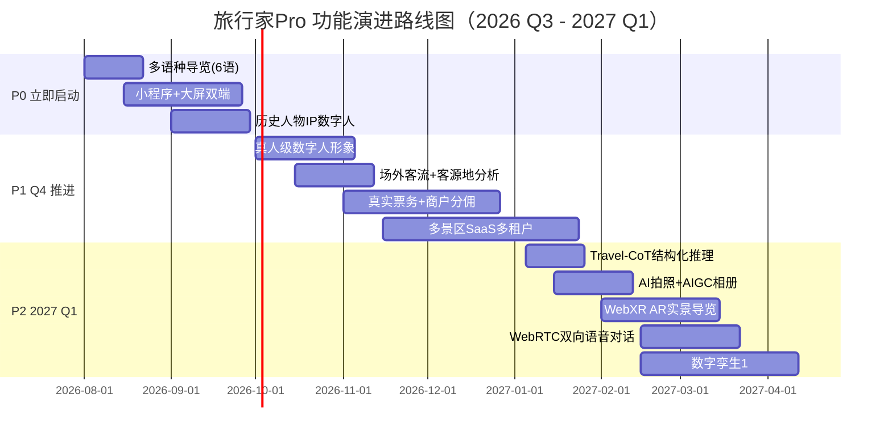

# 旅行家Pro · 国内外竞品调研与功能演进建议

> **文档目的**：系统调研国内外「AI 数字人导游 / 智慧文旅」赛道类似项目，提炼其核心能力与特色功能，并结合本项目（旅行家Pro）当前技术栈与产品矩阵，给出后续功能开发的优先级建议。
>
> **调研时间**：2026-07-24
> **项目版本**：Next.js 16.2 + React 19 + DeepSeek-V4-Pro + StepFun 3.7-Flash + Live2D + MCP

---

## 一、调研背景与对标维度

### 1.1 本项目核心能力速览

| 维度 | 当前能力 |
| :--- | :--- |
| **产品形态** | C端 Web/PWA + B端管理后台 + MCP 开放接口（单景区部署） |
| **AI 对话** | Hybrid RAG（0.7语义 + 0.3关键词）、SSE 流式、3级降级容灾 |
| **多模态** | VR 即拍即识（StepFun 3.7-Flash 视觉）、TTS/STT 语音 |
| **数字人** | Live2D Cubism 5.x + SVG 降级（5种情绪状态）、基础口型同步 |
| **路线规划** | @turf/turf 球面距离 + 兴趣标签 + 时长配比 |
| **无障碍** | 普通/银发/儿童 三模式（UI + Prompt 全链路适配） |
| **运营后台** | 数据大屏、知识库管理、景点 CRUD、数字人装扮、情感分析、热词云 |
| **生态开放** | MCP 协议 7 个标准工具（list-spots、ask-question、book-ticket 等） |

### 1.2 对标维度

按以下 8 个维度横向对比：

`①核心AI能力` `②数字人形态` `③多端覆盖` `④多语种` `⑤运营数据深度` `⑥生态开放` `⑦商业化/票务` `⑧无障碍与适老化`

---

## 二、国内竞品调研

| # | 产品/项目 | 所属方 | 核心能力 | 特色功能 | 产品链接 |
| :--- | :--- | :--- | :--- | :--- | :--- |
| 1 | **沪小游** | 上海市文化和旅游局 | 城市级智能体，整合 36 大类/107 小类文旅资源，支持 10+ 语种，已服务近 2000 万人次 | 基于位置主动推荐附近活动；游前规划-途中导览-消费购票全流程；多语种切换 | [新华网报道](https://app.xinhuanet.com/news/article.html?articleId=20260721fb04d1bd4ca34262828d12a2bc9b21c4) |
| 2 | **嗨玉溪** | 玉溪融合文旅 + 中国电信 | AI 数字人导游小程序，覆盖行前规划-在途服务-游后体验全流程 | "玩法地图/兴趣搭子/旅游话题"社交化出游；商户半自营数字化经营；消费券领取中心 | [搜狐报道](https://m.sohu.com/a/1051595918_121106902/) |
| 3 | **讯飞 AI 虚拟人交互平台** | 科大讯飞 | 星火大模型 + 数字人 + 语音交互全链路；在线/离线双模数字人 | 智能交互机（景区入口）+ 移动数字人（自主行走）+ 文旅 IP 数字人（李白/张继）；仅需上传 Word 即可零代码学习知识库；大唐不夜城"唐小宝" | [中国经营报报道](http://www.cb.com.cn/index/show/gd/cv/cv1362548401490) |
| 4 | **腾讯云智能数智人** | 腾讯云 | 多模态人机交互系统，首帧延迟 < 600ms，1 张照片即可生成数字人 | WebGL/Unity/UE 多渲染引擎；文本/声音/单目摄像头三驱动；2D/3D 全风格；TRTC/WebRTC 实时通信 | [腾讯云数智人](https://www.tencentcloud.com/zh/products/ivh) |
| 5 | **腾讯文旅** | 腾讯云 | 目的地名片/城市行囊/智慧景区/景区直播标准产品矩阵 | 微信小程序原生地图 + 室内外一体化导航 + AR 导航；客流实时监测热力图 + 智能拥堵引导；南京博物院、北京环球度假区案例 | [腾讯文旅方案](https://cloud.tencent.com/solution/tourism) |
| 6 | **百度智能云客悦 + 文心** | 百度智能云 | 文心 5.0（2.4万亿参数原生全模态）+ 客悦 Agent 体系；"IP+Agent" 模式 | 复活历史人物 IP：峨眉山"AI财神"、邹城"孟子"、澳门"麦麦"；4D驱动+全骨骼驱动真人级形象；建模周期月级→天级、成本降 70%+ | [中国青年网报道](http://t.m.youth.cn/transfer/index/url/d.youth.cn/newtech/202602/t20260223_16523870.htm) |
| 7 | **百度地图"景区一图游"** | 百度智能云 + 百度地图 | 活地图 + 活攻略，文心智能体无缝嵌入，企业定制知识库 | 客流空间监测 + 游客画像 + 潜力客源地分析三大数据服务；武汉东湖上线后导航量同比增 50.8% | [头条报道](http://m.toutiao.com/group/7665774902472917504/) |
| 8 | **科大讯飞"星火伴游"** | 科大讯飞 | 星火大模型 + 200+ 语种实时互译 + 高逼真情感数字人 | 千人千面讲解内容生成；可替代 30%+ 人工导览岗位 | [搜狐梳理](https://m.sohu.com/a/999885130_120086853/) |
| 9 | **魔珐星云 XmovAvatar** | 魔珐科技 | 端侧渲染 + 参数流架构，端到端延迟 < 500ms | 破解"低延迟/高并发/低成本"不可能三角；带宽消耗较视频流降 95%+；Vue3+Vite+腾讯云ASR+豆包大模型栈 | [CSDN实战](https://chian-ocean.blog.csdn.net/article/details/160583383) |
| 10 | **爱可声 AI 数字人导览** | 爱可声 | 纯软件小程序方案，扫码即用 | 已落地 100+ 家博物馆；轻量化快速复制；适合预算有限的中小场馆 | [什么值得买对比](https://post.m.smzdm.com/p/ak85xv88/) |
| 11 | **山东品信数字人** | 山东品信 | 大模型 + 企业知识库，支持访客随时打断追问 | 三形态：序厅迎宾屏 + 定点讲解数字人 + 随身小程序伴游；3D 超写实影视级建模 | [什么值得买对比](https://post.m.smzdm.com/p/ak85xv88/) |
| 12 | **CMDAI 导览机器人 V1.0** | CMDAI | 实体机器人 + 大模型 + 定制知识库 | 自主移动 + 动态避障 + 自动回充；真人形象与语音复刻；可带领游客前往指定区域 | [什么值得买对比](https://post.m.smzdm.com/p/ak85xv88/) |

---

## 三、国际竞品调研

| # | 产品/项目 | 国家/地区 | 核心能力 | 特色功能 | 产品链接 |
| :--- | :--- | :--- | :--- | :--- | :--- |
| 1 | **SmartGuide** | 捷克（全球） | 数字语音导览 SaaS 平台，30+ 语言，覆盖 100k 景点 | 无代码 CMS 自建指南；访客行为大数据 + 热图分析；SEO 索引数字指南引流；6k 当地向导、99.99% SLA | [smartguide.app](https://www.smartguide.app/) |
| 2 | **aReception** | 捷克 | 语音助手 + 人脸数字人，50+ 语言，400+ 预设 avatar | 复活历史人物（达芬奇、Karel Absolon）；隐私友好（不存储个人数据）；终端激活式接待 | [areception.ai/museums](https://www.areception.ai/museums/) |
| 3 | **AI Museum Pal** | 国际（iOS App） | 多博物馆统一 App，覆盖卢浮宫/大英/MoMA 等顶级场馆 | Must-see 路线 + One-room 选项；扫码/输入藏品 ID 即时查询；Walk & See 模式随时提问 | [App Store](https://apps.apple.com/co/app/ai-museum-pal/id6745568922) |
| 4 | **TourismGo** | 国际（iOS App） | 位置感知 + 上下文 AI 导游 | Place Chats（与地标/博物馆对话）/ City Chats；拍照提问精准识别；语音双手解放导览 | [App Store](https://apps.apple.com/au/app/tourismgo-ai-tour-guide/id6755204865) |
| 5 | **DORI 多语言自主导览机器人** | 韩国（开源） | RAG + LLM + 自主导航机器人，8 语种 | MediaPipe 自动游客拍照；GPS+IMU+里程计 EKF 融合导航；景福宫实景部署 | [GitHub 项目](https://github.com/P-Project-Dori/QnA) |
| 6 | **TraveLLaMA** | 港科大 + 中大 + 上海AI Lab（AAAI-26 学术） | 多模态旅行助手专用大模型，TravelQA 265k QA 数据集 | Travel-CoT 结构化推理（空间/时间/实用三维度分解）；准确率提升 10.8%；SUS 可用性评分 82.5 | [AAAI 论文](https://ojs.aaai.org/index.php/AAAI/article/download/37335/41297) |
| 7 | **Balzi Rossi VR 虚拟导游** | 意大利（学术原型） | VR + ConvAI NPCs，MetaHuman Creator + Unreal Engine | 复活" Dame du Cavillon"上古人骨为虚拟导游；Mixamo 动作重定向；Inworld Studio 对话系统集成 | [论文 PDF](https://conference.pixel-online.net/FOE/ICT4LL/files/foe/ed0015/FP/10092-SENG7355-FP-FOE15.pdf) |
| 8 | **Museum Chatbot (MCP+LLM)** | 印度（学术） | LLM + MCP Server 四层架构，权限化数据访问 | 多轮对话上下文记忆 + 动态语气适配 + 多语生成；角色权限防止敏感档案泄露；可扩展至艺术馆/遗产机构 | [论文 PDF](https://www.jsetms.com/admin/uploads/nF5b4V.pdf) |

---

## 四、多维对比分析

### 4.1 能力雷达对比

| 能力维度 | 旅行家Pro（本项目） | 国内头部均值 | 国际头部均值 |
| :--- | :--- | :--- | :--- |
| **多端覆盖** | ⭐⭐ Web/PWA 单端 | ⭐⭐⭐⭐⭐ 小程序+APP+大屏+机器人 | ⭐⭐⭐⭐ iOS App + Web + Kiosk |
| **多语种** | ⭐ 中文为主 | ⭐⭐⭐⭐⭐ 200+ 语种互译 | ⭐⭐⭐⭐ 30-50+ 语种 |
| **数字人形象** | ⭐⭐⭐ Live2D + SVG | ⭐⭐⭐⭐⭐ 真人级 4D 驱动 + 一键克隆 | ⭐⭐⭐⭐ MetaHuman + 历史人物复活 |
| **多模态理解** | ⭐⭐⭐⭐ RAG + VR 即拍即识 | ⭐⭐⭐⭐ 文心5.0 原生全模态 + Qwen-Omni | ⭐⭐⭐⭐ GPT-4o + 多模态推理 |
| **无障碍/适老** | ⭐⭐⭐⭐⭐ 三模式全链路（业内领先） | ⭐⭐ 普遍较弱 | ⭐⭐⭐ 部分支持 |
| **运营数据深度** | ⭐⭐⭐ 单景区大屏 + 情感分析 | ⭐⭐⭐⭐⭐ 场外客流+客源地+热力图+营销归因 | ⭐⭐⭐⭐ 行为热图 + 转化漏斗 |
| **生态开放** | ⭐⭐⭐⭐⭐ MCP 7 工具（业内首个景区 MCP） | ⭐⭐⭐ 多为私有 SDK/API | ⭐⭐⭐ 部分支持 MCP（学术） |
| **商业化/票务** | ⭐⭐ 模拟优惠券 | ⭐⭐⭐⭐⭐ 真实闸机核销+支付+积分商城 | ⭐⭐⭐⭐ 订阅 SaaS + 应用内购 |
| **结构化推理** | ⭐⭐⭐ 单轮兴趣匹配 | ⭐⭐⭐ 多智能体协同 | ⭐⭐⭐⭐ Travel-CoT 思维链 |

### 4.2 核心洞察

1. **本项目优势明显项**：`无障碍三模式`、`MCP 协议开放生态`、`Hybrid RAG 抑制幻觉`、`端到端 <1.8s 流式`、`PWA 弱网可用` —— 这些是差异化护城河，应继续强化而非补齐短板式模仿。
2. **本项目短板项**：`多端形态单一`、`多语种缺失`、`真人级数字人形象缺失`、`场外客流/客源地分析不足`、`真实票务与商户生态未打通`、`历史人物 IP 未复活`。
3. **行业趋势项**：`原生全模态大模型`（文心5.0/Qwen-Omni）、`IP+Agent 模式`、`结构化推理CoT`、`端云协同`、`数字孪生1:1建模` —— 是未来 1-2 年的技术红利窗口。

---

## 五、后续功能开发建议

> **方法论**：每条建议标注 `差异化/补齐/趋势/商业化` 四类标签，并给出 `优先级（P0 最高）/预估周期/技术依赖`，便于排期决策。

| # | 建议功能 | 类别 | 优先级 | 预估周期 | 技术依赖 | 落地说明 |
| :--- | :--- | :--- | :--- | :--- | :--- | :--- |
| 1 | **多语种导览（中/英/日/韩/法/西 6 语起步）** | 补齐 | P0 | 2-3 周 | DeepSeek 多语 prompt + Eazo TTS 多音色 | System Prompt 注入目标语种；TTS 调用对应语种音色；前端增加语种切换器；接入沪小游/讯飞 i18n 方案参考 |
| 2 | **微信小程序原生端 + 大屏交互机双形态** | 补齐 | P0 | 4-6 周 | Taro/原生小程序 + 大屏 Vue3 适配 | 复用现有 Next.js API；C 端核心流程封装为小程序；大屏端引入魔珐星云/腾讯数智人 SDK（端侧渲染 <500ms） |
| 3 | **历史人物 IP 数字人复活（李白/苏轼/本土名人）** | 差异化 | P0 | 3-4 周 | 真人级数字人 SDK + RAG 人物语料库 | 对标百度"AI财神"；用 1 张历史画像 + 文献语料训练专属人设；MCP 新增 `talk-to-historical-figure` 工具 |
| 4 | **真人级数字人形象升级（照片/视频克隆）** | 补齐 | P1 | 3-5 周 | 通义万相/腾讯数智人/魔珐 SDK | Live2D 保留为卡通风格备选；增加"真人形象"档位，1 张照片 5 秒音视频克隆；后台 avatar 配置页扩展 |
| 5 | **场外客流 + 客源地 + 热力图分析** | 补齐 | P1 | 3-4 周 | 腾讯/百度 LBS API + 数据中台 | 对标百度"景区一图游"；接入场外 LBS 数据；新增"潜力客源地""客流来源城市分布""同业竞争分析"三大数据模块 |
| 6 | **真实票务 + 闸机核销 + 商户分佣** | 商业化 | P1 | 6-8 周 | 动态加密 QR + 支付网关 + 商户 SaaS | 兑现 README 规划；MCP `book-ticket` 工具对接真实票务系统；新增商户后台、积分商城、分佣结算 |
| 7 | **多景区 SaaS 多租户平台** | 商业化 | P1 | 8-10 周 | 多租户数据隔离 + 配置化引擎 + 租户计费 | 兑现 README 规划；schema 增加 `tenant_id`；后台增加"景区自助入驻"流程；按调用次数/景区数计费 |
| 8 | **Travel-CoT 结构化路线推理** | 趋势 | P2 | 2-3 周 | DeepSeek-CoT prompt + JSON Schema | 对标 TraveLLaMA；路线生成 prompt 拆解为空间/时间/实用三维度；输出可解释决策路径，提升推荐准确率 10%+ |
| 9 | **AI 主动给游客拍照 + AIGC 旅行记忆相册** | 差异化 | P2 | 3-4 周 | MediaPipe 人物检测 + 通义万相2.5视频生成 | 对标 DORI 自动拍照；数字人主动构图抓拍；游后生成 30s 旅行 Vlog + 海报，激励社交分享 |
| 10 | **WebXR AR 实景叠加导览** | 趋势 | P2 | 4-6 周 | WebXR Device API + 陀螺仪 + 3D 模型 | 兑现 README 规划；手机对准建筑即出现 AR 讲解图层；优先 iOS Safari + Android Chrome 兼容 |
| 11 | **WebRTC 双向实时语音对话（VoIP，支持打断）** | 趋势 | P2 | 4-5 周 | WebRTC + 流式 ASR + 流式 TTS | 兑现 README 规划；类微信通话体验；首字延迟 < 800ms；保留 STT→LLM→TTS 单工作为降级 |
| 12 | **数字孪生 1:1 三维景区建模** | 趋势 | P2 | 6-8 周 | 无人机 LiDAR 扫描 + Unity/Three.js 渲染 | 对标腾讯数字孪生；B 端增加"数字孪生运营舱"；C 端支持鸟瞰模式浏览全景区 |
| 13 | **多智能体协同旅行助手** | 趋势 | P3 | 4-6 周 | 百炼/Coze/Dify + Multi-Agent 框架 | 对标阿里飞猪多智能体；分工：行程规划 Agent + 餐饮推荐 Agent + 应急服务 Agent + 翻译 Agent |
| 14 | **数字藏品/NFT 文创商城** | 商业化 | P3 | 3-4 周 | 区块链存证 + 钱包 SDK | 景区专属数字纪念品；游览成就解锁铸造权；与足迹勋章系统打通 |
| 15 | **更多 MCP 工具与第三方 Agent 平台对接** | 差异化 | P3 | 持续 | MCP 协议扩展 + Webhook | 兑现 README 规划；新增 `get-weather`/`translate`/`order-food`/`call-shuttle` 等工具；接入 Coze、Dify、扣子 |
| 16 | **UGC 社交化出游（玩法地图/兴趣搭子/旅游话题）** | 差异化 | P3 | 4-5 周 | 社区模块 + 内容审核 + LBS 匹配 | 对标嗨玉溪；游客发布真实分享；同好结伴；景区UGC内容反哺 RAG 知识库 |
| 17 | **Live2D 高级口型同步（Viseme 对齐）** | 趋势 | P3 | 2-3 周 | Web Audio API + 实时 FFT 频谱 | 兑现 README 规划；分析 TTS 音频声谱实时计算 Viseme 音素；驱动精确口型 |
| 18 | **AI 内容生成工厂（宣传视频/PPT/海报）** | 趋势 | P3 | 3-4 周 | 通义万相2.5 + Code Interpreter 沙箱 | B 端运营一键生成景区宣传短视频、汇报 PPT；C 端生成个人游后纪念文档 |

---

## 六、优先级路线图（建议排期）

### 6.1 阶段目标

- **P0 阶段（2026 Q3）**：解决"补齐短板"——多语种、多端、IP 数字人。让产品具备与国内头部对标的基础能力。
- **P1 阶段（2026 Q4）**：解决"商业化闭环"——真实票务、商户生态、SaaS 多租户。从单景区定制走向可复制的商业化产品。
- **P2 阶段（2027 Q1）**：解决"技术红利"——CoT 推理、AR、WebRTC、数字孪生。抢占下一轮技术窗口，建立代差优势。
- **P3 阶段（持续迭代）**：生态扩展与差异化创新——多智能体、数字藏品、UGC 社交、AIGC 内容工厂、Viseme 口型。

### 6.2 资源建议

| 阶段 | 建议人力配置 | 关键风险 |
| :--- | :--- | :--- |
| P0 | 1 全栈 + 0.5 设计 + 0.5 测试 | 小程序审核周期、历史人物 IP 授权 |
| P1 | 1 全栈 + 1 后端 + 0.5 商务 | 支付资质、商户接入意愿、多租户性能 |
| P2 | 1 全栈 + 1 算法 + 0.5 硬件 | WebXR 浏览器兼容、WebRTC 延迟、数字孪生采集成本 |
| P3 | 视优先级动态调配 | 第三方平台政策变化、区块链合规 |

---

## 七、信息来源

### 国内竞品
- [新华网：数智新生活｜AI+文旅带来"诗和远方"新体验（沪小游）](https://app.xinhuanet.com/news/article.html?articleId=20260721fb04d1bd4ca34262828d12a2bc9b21c4)
- [搜狐：玉溪"嗨玉溪"小程序上线](https://m.sohu.com/a/1051595918_121106902/)
- [中国经营报：讯飞 AI 虚拟人交互平台开启智慧文旅新体验](http://www.cb.com.cn/index/show/gd/cv/cv1362548401490)
- [腾讯云智能数智人官网](https://www.tencentcloud.com/zh/products/ivh)
- [腾讯文旅行业解决方案](https://cloud.tencent.com/solution/tourism)
- [中国青年网：峨眉文旅携手百度智能云探索文旅数字化创新](http://t.m.youth.cn/transfer/index/url/d.youth.cn/newtech/202602/t20260223_16523870.htm)
- [头条：百度图云"景区一图游"为文旅增收辟新径](http://m.toutiao.com/group/7665774902472917504/)
- [搜狐：智慧文旅服务商如何选型](https://m.sohu.com/a/999885130_120086853/)
- [CSDN：魔珐星云 SDK 实战开发](https://chian-ocean.blog.csdn.net/article/details/160583383)
- [什么值得买：AI 导览三大主流方案对比](https://post.m.smzdm.com/p/ak85xv88/)
- [CSDN：数字人实时交互技术在文旅景区的创新应用](https://blog.csdn.net/oJimmyZhou/article/details/147126507)

### 国际竞品
- [SmartGuide 官网](https://www.smartguide.app/)
- [aReception 博物馆 AI 导览](https://www.areception.ai/museums/)
- [App Store：AI Museum Pal](https://apps.apple.com/co/app/ai-museum-pal/id6745568922)
- [App Store：TourismGo AI Tour Guide](https://apps.apple.com/au/app/tourismgo-ai-tour-guide/id6755204865)
- [GitHub：DORI 多语言自主导览机器人](https://github.com/P-Project-Dori/QnA)
- [AAAI-26 论文：TraveLLaMA 多模态旅行助手](https://ojs.aaai.org/index.php/AAAI/article/download/37335/41297)
- [Balzi Rossi VR 虚拟导游论文](https://conference.pixel-online.net/FOE/ICT4LL/files/foe/ed0015/FP/10092-SENG7355-FP-FOE15.pdf)
- [Museum Chatbot Using MCP Servers and LLMs 论文](https://www.jsetms.com/admin/uploads/nF5b4V.pdf)
- [ACM：多模态 AI 虚拟数字人博物馆导览设计与实现](https://dlnext.acm.org/doi/10.1145/3806262.3806323)

---

> **结语**：旅行家Pro 已具备业内领先的 `无障碍三模式` + `MCP 开放生态` + `Hybrid RAG` 三大差异化护城河。后续演进应坚持"补齐基础短板（P0）→ 闭环商业化（P1）→ 抢占技术红利（P2）→ 生态扩展（P3）"的节奏，避免盲目跟风堆功能。每条建议落地前建议先用 MCP 工具 + RAG 知识库做最小可行验证（MVP），再投入完整资源。
